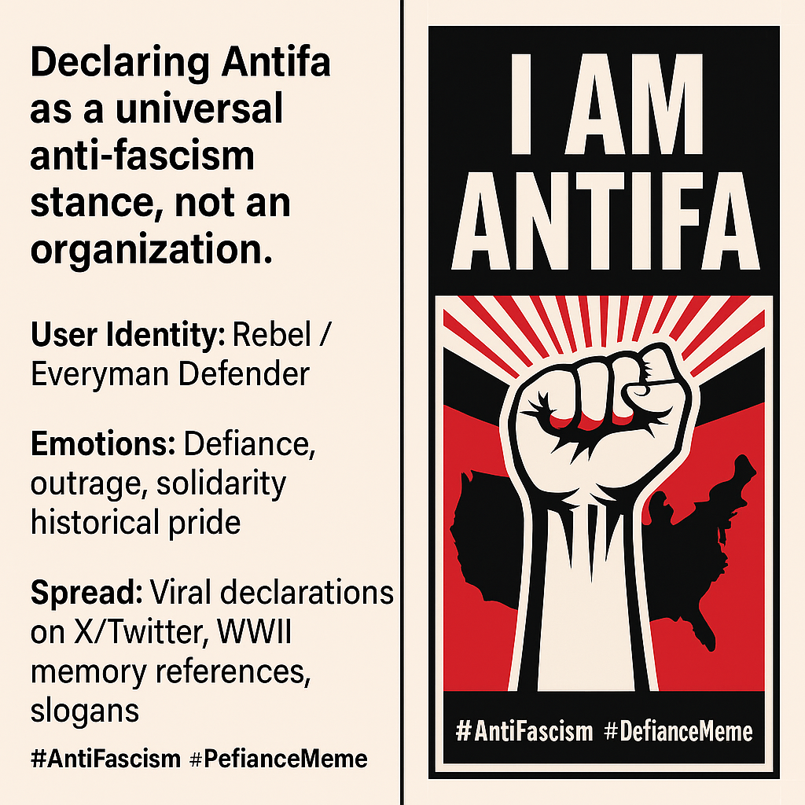

# Reframing Antifa: A Universal Identity Against Fascism

Created at 2025/09/22 6:31 PM

🧩 Title: “I Am Antifa” — The Identity as Defiance Meme  **🧠 Core Idea Unit**: Declaring “I am Antifa” reframes Antifa from an organized threat (as framed by opponents) into a universal stance against fascism. It encodes: If you oppose fascism, you are Antifa.  Not sure about “Antifa”? [Try “Profa”](https://app.me.bot/memory/VFCYFUZ2LNHMLKNX)  **🎭 Identity Play & Roles**: 	•	Self as Rebel/Defender: Casts the declarer as part of a long lineage of anti-fascist resistance (WWII soldiers, ancestors, family). 	•	Everyman Hero: Positions “Antifa” as ordinary, moral Americans rather than radicals. 	•	Counter-Label: Reclaims a stigmatized label into a badge of honor.  **💥 Emotional Triggers**: 	•	😡 Outrage at Trump’s framing of Antifa as terrorists 	•	💪 Defiance & solidarity against fascism 	•	😢 Nostalgia for WWII anti-fascist struggle 	•	🧠 Clarification against misinformation  **📡 Spread Mechanics**: 	•	Distribution Vectors: X/Twitter, especially amid Trump’s Sept 2025 announcement. 	•	Propagation Style: Aphoristic declarations, quote-box slogans, personal testimony, casual selfies with text overlays, and WWII family references.  **🛡️ Defense Reflexes**: 	•	Semantic Reframe: “Antifa means anti-fascist—literally.” 	•	Moral Shield: Positioning against fascism is framed as inherently good. 	•	Genealogical Anchor: “My grandfather was Antifa” → ties to patriotic history.  **🧬 Memeplex Anchor Points**: 	•	🇺🇸 American WWII memory & anti-Nazi victory narratives 	•	📱 Digital counter-mobilization against Trumpism 	•	⚖️ Free speech & First Amendment rights discourse 	•	🧩 Anti-fascist historical continuity  **🧠 Sticky Symbols or Quotes**: 	•	“ANTIFA = ANTI-FAscist. Literally what it means.” 	•	“I am Antifa. My grandfather was Antifa.” 	•	✊ Raised fist emoji + Antifa acronym 	•	“Pass it on.”  **🏷️ Tags**: #AntiFascism #IdentityReclaim #DefianceMeme #WWIILinkage #PoliticalIdentity #LabelReversal  Top Posts Declaring “I am Antifa” or “I am ANTIFA” Based on recent activity on X (primarily from mid-September 2025 onward, amid discussions of Trump’s designation of Antifa as a terrorist organization), here are the most engaged posts explicitly using the phrase “I am Antifa” or “I am ANTIFA.”  - Post by Brian Krassenstein (@krassenstein): Timestamp: Thu, 18 Sep 2025 01:10:02 GMT. “I am ANTIFA. MEANING I AM AGAINST fascism. All Americans should be. ANTIFA is not an organization… Trump did not have legal authority to unilaterally designate Antifa as a terrorist organization.” [Engagement: 16,452 likes, 1.2M views.](https://x.com/krassenstein/status/1968482615402369143)  - Post by Brian Krassenstein (@krassenstein): Timestamp: Mon, 22 Sep 2025 23:56:41 GMT. “I am ANTIFA - Anti-Fascist. I am exercising my First Amendment rights… My Grandfather was also Antifa and he helped us defeat the Nazis in WWII.” Includes a video. [Engagement: 345 likes, 12K views.](https://x.com/krassenstein/status/1970276095619448865)  - Post by Derek (@DerekNeverFails): Timestamp: Sat, 20 Sep 2025 14:01:47 GMT. “ANTIFA= ANTI FAscist. Literally what it means. I am ANTIFA. Your grandparents were.” [Engagement: 6,637 likes, 663K views.](https://x.com/DerekNeverFails/status/1969401607461732506)  - Post by Atheist Girl (@iamAtheistGirl): Timestamp: Fri, 19 Sep 2025 14:48:40 GMT. “i am antifa ✊ because fuck fascism.” Includes an image. [Engagement: 1,722 likes, 29K views.](https://x.com/iamAtheistGirl/status/1969051019347722248)  - Post by Jamie Bonkiewicz (@JamieBonkiewicz): Timestamp: Thu, 18 Sep 2025 13:44:05 GMT. “Good morning and happy Thursday! I AM ANTIFA ✌️😘.” Includes an image. [Engagement: 506 likes, 5K views.](https://x.com/JamieBonkiewicz/status/1968672376737907031)  - Post by Sheree’ Woke AF 🥥🌴 (@ShereeWokeAF): Timestamp: Tue, 02 Sep 2025 06:27:56 GMT. “I am ANTIFA EVERYDAY, ALL DAY!!” Includes an image. [Engagement: 55 likes, 762 views.](https://x.com/JamieBonkiewicz/status/1968672376737907031) 	 - Post by Tandem ✳️ (@tandem21): Timestamp: Thu, 18 Sep 2025 01:47:32 GMT. “I am ANTIFA. Trump has no idea what it means. These guys are ANITFA. NEVER FORGET THAT!!!” Includes a video (GIF). [Engagement: 34 likes, 783 views.](https://x.com/tandem21/status/1968492052309573723)  - Post by Bryan McAllister (@finedogcreative): Timestamp: Thu, 18 Sep 2025 01:24:39 GMT. “I. Am. Antifa. Pass it on.” Includes a video (GIF). [Engagement: 2 likes, 112 views.](https://x.com/finedogcreative/status/1968486291206455578)  - Post by Heidi 🏖 🐬💙🍹🌊 (@Brodiesmom68): Timestamp: Sat, 23 Aug 2025 17:40:13 GMT. “#Fascism I am ANTIFA✊.” Includes an image. [Engagement: 12 likes, 203 views.](https://x.com/Brodiesmom68/status/1959309716124807611)   - Post by PiT BuLL hugger🏴‍☠️🍉🇺🇦 (@CleggAdrienne): Timestamp: Fri, 19 Sep 2025 22:55:16 GMT. “I am 66 year old and i am ANTIFA I WILL NOT COMPLY.” [Includes an image. Engagement: 3 likes, 71 views. ](https://x.com/CleggAdrienne/status/1969173473344864468)   

## Resources
- https://object.me.bot/front-img/note/attachments/img/1758591058951/IMG_7184.JPG
- https://object.me.bot/front-img/note/attachments/img/1758591058952/0E574211-0B4D-4184-B63B-3C477342BBFB.png

