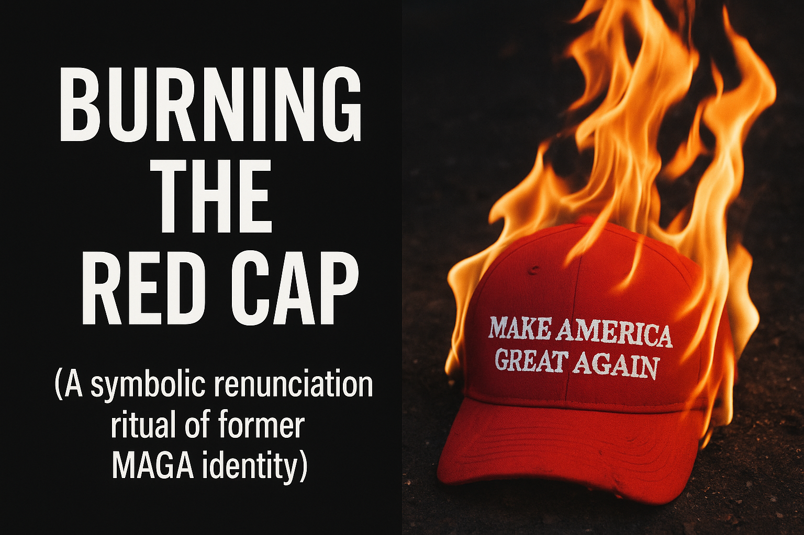

# Ritual of Renunciation: Burning the MAGA Cap

Created at 2025/11/17 2:06 PM

**🔥 Title: Burning the Red Cap** (A symbolic renunciation ritual of former MAGA identity)  ⸻  ∴ Core Idea Unit  A public act of unbinding: burning Trump merch becomes a ritual that dissolves prior allegiance. The mental shift: from follower → ex-believer; from identity fusion → identity purge.  ⸻  ▲ Identity Play & Roles  Role: The Penitent Defector Performs the culturally legible arc of “breaking free from a cult.” Repositions the self as morally awakened, betrayed-but-redeemed, newly aligned with “truth.”  ⸻  ≈ Emotional Triggers 	•	Outrage (Epstein file allegations, perceived moral corruption) 	•	Disillusionment (policy betrayal, “America First” contradictions) 	•	Shame → Cleansing (burning as purification) 	•	Regret (post-election remorse) 	•	Revolt Energy (collective catharsis, dramatic group burnings)  ⸻  𐂷 Spread Mechanics  Distribution Vectors: X threads · YouTube Shorts · TikTok cross-posts · stitched reaction clips · protest livestreams  Propagation Style: Shock ritual · confessional montage · cult-exit narrative · dramatic fire imagery · morally outraged captions (“final straw,” “breaking free,” “not your mascot”)  ⸻  ⛨ Defense Reflexes 	•	Moral Shielding: “I was deceived; now I see.” 	•	Testimonial Authenticity: personal regret narrations frame criticism as lived truth, not partisan attack. 	•	Cult-Exit Immunity: adoption of “escaper” identity inoculates against being recast as gullible. 	•	Symbolic Fire: burning frames any critique as part of the cleansing process itself.  ⸻  ☷ Memeplex Anchor Points 	•	Cult-exit narratives (NXIVM, Scientology parallels) 	•	Populist betrayal tropes (“sold out,” “stabbed in the back”) 	•	Political disillusionment cycles 	•	Ritualized dissent (flag burnings, book burnings, effigy destruction) 	•	Post-election regret genres 	•	Hyperreal spectacle politics (ritual fire as content-engine)  ⸻  ✶ Sticky Symbols & Quotes  Symbols: 🔥 Hat-in-flames silhouette 🧢 Red cap turning to ash 🔓 Breaking-free chain imagery 📼 Nighttime bonfire montage  Sticky Phrases: 	•	“Final straw.” 	•	“Breaking free from the cult.” 	•	“No more mascot.” 	•	“I won’t be played again.” 	•	“I’m done falling for it.”  ⸻  ∿ Tags  #CultExit · #BurnTheHat · #Disillusionment · #BetrayalFrame · #MAGAAfterlife · #SpectacleRitual · #IdentityPurge  ⸻  [Meme clusters analyzed via X](https://second.me/memory/UCML1PNXHUGUOCBX)

## Resources
- https://object.me.bot/front-img/note/attachments/img/1763417187626/6B5D806D-E5A3-4783-B7E1-A42AE7E1A3A7.png

## Insight

* The image captures a highly charged symbolic act: the burning of a red MAGA hat, representing a public renunciation of former affiliations. This act serves as a powerful ritualized statement, paralleling historical instances of dissent associated with strong emotional responses and identity shifts.
* The core idea of transitioning from a follower to an ex-believer reflects a significant psychological transformation. This movement can be contrasted with similar cultural narratives of cult exits, where individuals experience a desire for purification or redemption as they reject previous allegiances.
* Emotional triggers such as outrage and disillusionment are potent motivators for such acts, evoking a collective catharsis that resonates with broader narratives of betrayal and moral corruption, particularly relevant to current political climates.
* The ritual of burning, often viewed as a form of cleansing, parallels other cultural practices—like flag burnings or book burnings—that symbolize the rejection of ideologies or identities. This highlights the use of dramatic imagery in digital media and protest culture, amplifying the virality of such acts through platforms like TikTok and YouTube.
* The transformation from a cult-like identity to an awakened moral figure involves complex defense mechanisms, wherein individuals recount their experiences as a means of providing authenticity to their newfound perspectives. This narrative strategy effectively shields them from being perceived as deceived or gullible, solidifying their stance as informed and morally sound in the eyes of others.
