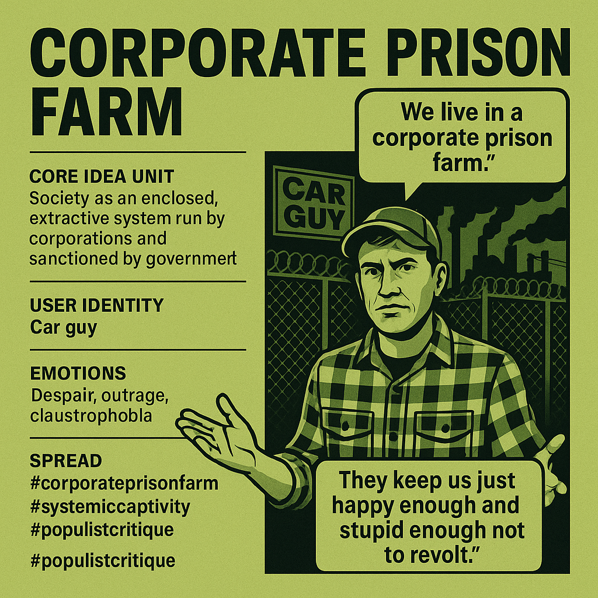

# Systemic Captivity of Workers as Corporate Prison

Created at 2025/10/04 10:00 AM

Mini-Memetic Profile: “Corporate Prison Farm” Source: [Casey the Car Guy Snaps](https://youtu.be/QdSJ6w3RNAA?si=bj4j9FJ78tn5ZIDc) ⸻  🧠 Core Idea Unit  A populist metaphor translating systemic economic entrapment into visceral imagery of captivity. Society is depicted as an industrial enclosure—corporate-run, government-sanctioned—where workers are both labor and livestock. Freedom becomes performance; rebellion becomes spectacle.  ⸻  🎭 Identity Play & Roles  Role Performed: The “Car Guy” or everyday worker awakening to systemic captivity. Repositioning: The self shifts from proud producer to exploited inmate—exposing the illusion of autonomy within consumer capitalism. Archetype: Blue-collar truth-teller; the disillusioned mechanic-philosopher in the garage confessional.  ⸻  💥 Emotional Triggers 	•	Primary: Despair, outrage, claustrophobia. 	•	Secondary: Solidarity through shared disillusionment. 	•	Affective Pathway: Comfort → Betrayal → Awareness → Anger → Cynical Empowerment. The meme converts latent economic anxiety into existential dread, offering catharsis through articulation (“We live in a corporate prison farm”).  ⸻  📡 Spread Mechanics  Distribution Vectors: YouTube monologues, short-form clips, populist podcasts, social memes with overlaid text. Propagation Style: Earnest revelation wrapped in dystopian aesthetics—garage lighting, authenticity cues, and working-class ethos. Algorithmic Hook: Resonates with anti-elitist outrage cycles; thrives on authenticity signaling (“real people telling hard truths”).  ⸻  🛡️ Defense Reflexes 	•	Preempts critique via “wake up” rhetoric—skeptics are “corporate shills.” 	•	Uses irony and resignation to deflect reformist optimism. 	•	Offers minimal actionable exit—solidarity in shared captivity replaces solution.  ⸻  🧬 Memeplex Anchor Points 	•	#SystemicCaptivity (anti-corporate populism) 	•	#EconomicAlienation (late-stage capitalism critique) 	•	#DigitalSerfdom (technological extension) 	•	#CarGuyRealism (blue-collar authenticity aesthetic)  Attaches to broader anti-establishment memeplexes: The Matrix, Debt Slavery, Great Reset, AI replacing humanity.  ⸻  🧠 Sticky Symbols or Quotes 	•	“We live in a corporate prison farm.” 	•	“They keep us just happy enough and stupid enough not to revolt.” 	•	Imagery of fences, factories, barcodes, and flannel—symbols of familiarity turned oppressive. 	•	The “Car Guy” sign becomes an ironic badge of captivity within consumer machinery.  ⸻  🏷️ Tags  #CorporatePrisonFarm · #SystemicCaptivity · #PopulistCritique · #EconomicDespair · #MemeticRealism 

## Resources
- https://object.me.bot/front-img/note/attachments/img/1759597245020/3C101BB6-0713-4357-A3D1-74E50597AE85.png

## Insight

* The image vividly encapsulates the core allegory of systemic entrapment, portraying society as a "corporate prison farm," aligning with the meme’s concept of economic and social captivity. Visual elements such as the barbed-wire fence and factory smoke evoke physical and existential barriers, emphasizing how corporate interests and government complicity confine the individual, stripping away notions of genuine autonomy.  
* The portrayal of the individual as a “Car Guy,” a blue-collar worker, serves as a symbolic archetype for the disillusioned, authentic worker awakening to systemic manipulation—highlighting the tension between labor identity and systemic exploitation. This aligns with the meme’s themes of grassroots truth-telling and populist critique, questioning the illusion of choice within consumer capitalism.  
* The speech bubbles and textual cues—"We live in a corporate prison farm" and "They keep us just happy enough and stupid enough not to revolt"—function as visceral—yet ironic—manifestos of societal status quo. They evoke feelings of despair, outrage, and claustrophobia, tapping into emotion-driven narratives that reinforce collective disillusionment and serve as rallying points for anti-elitist outrage.  
* The inclusion of the "Car Guy" sign as an ironic badge underscores the meme’s play on identity—transforming elements of blue-collar authenticity into symbols of captivity. It critiques how symbols of independence are co-opted into branding tools within the larger machinery of corporate control, echoing the meme’s emphasis on the illusion of agency.  
* The deliberate stylistic choices—garage lighting, authenticity cues—serve to enhance the sense of grassroots truth-telling, bolstering an anti-establishment narrative while fostering community solidarity among those who feel entrapped. The imagery, when connected with disparaging symbols like fences and barcodes, magnifies the visceral imagery of systemic oppression, reinforcing the populist metaphor of systemic captivity.
