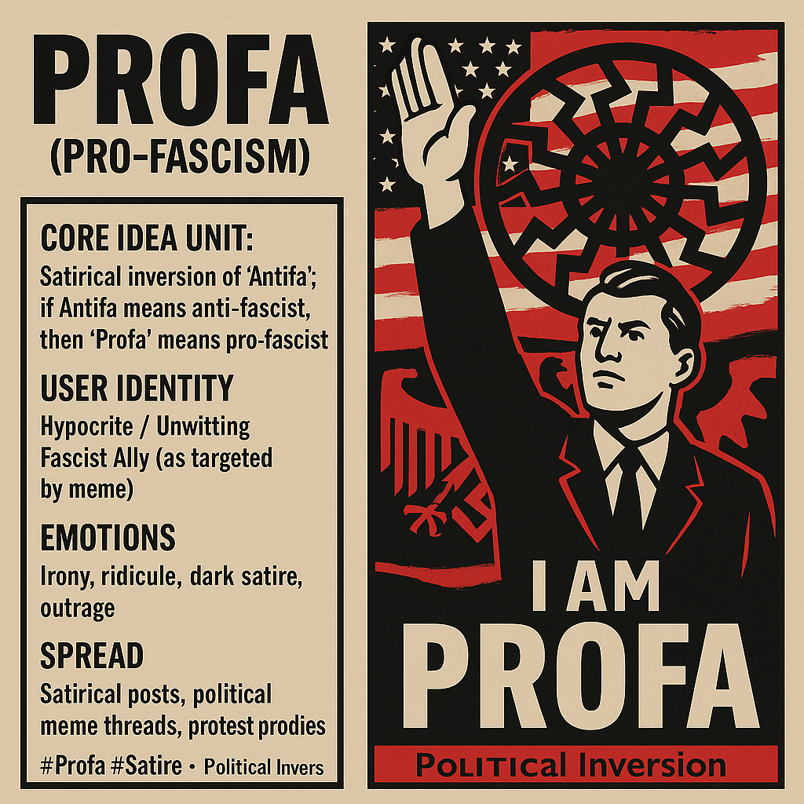

# 

Created at 2025/09/22 7:31 PM

**🧩 Title: “Profa” — Pro-Fascism as Satire**
### ∴ Core Idea Unit

Takes the slur “Antifa” (cast as chaos/terrorism) and mirrors it back: if Antifa = anti-fascist, then “Profa” = pro-fascist. The meme reframes authoritarian sympathizers as openly embracing what they implicitly defend.
### ▲ Identity Play & Roles

-	Targeted Role: Casts political opponents as “Profa” (i.e., unwitting fascist allies).
-	Self Role: The meme user becomes a truth-teller or trickster, exposing hypocrisy.
### ≈ Emotional Triggers

-	😆 Dark humor / irony
-	😡 Outrage at authoritarianism reframed
-	🤯 Disorientation at word inversion
-	🧠 Clarification by absurd reduction
### 𐂷 Spread Mechanics

-	Distribution Vectors: Satirical posts on X, meme accounts, political threads, protest signs.
-	Propagation Style: Irony, inversion, aphoristic one-liners (“If you’re not Antifa… guess you’re Profa”).
### ⛨ Defense Reflexes

-	Irony Shield: Always claim satire — “just a joke.”
-	Semantic Trap: Forces critics to defend why they aren’t “Profa.”
### ☷ Memeplex Anchor Points

-	⚖️ Free speech & rhetorical inversion
-	🤡 Clown World irony culture
-	📚 Anti-authoritarian critique via humor
### ✶ Sticky Symbols or Quotes

-	“If you’re not Antifa… you’re Profa.”
-	“Proud Profa rally today (just wear your brown shirts).”
-	Black sun → flipped into cartoonish logo.
### ∿ Tags

#Profa #Satire #WordInversion #ClownWorldPolitics #AntiAuthoritarian
