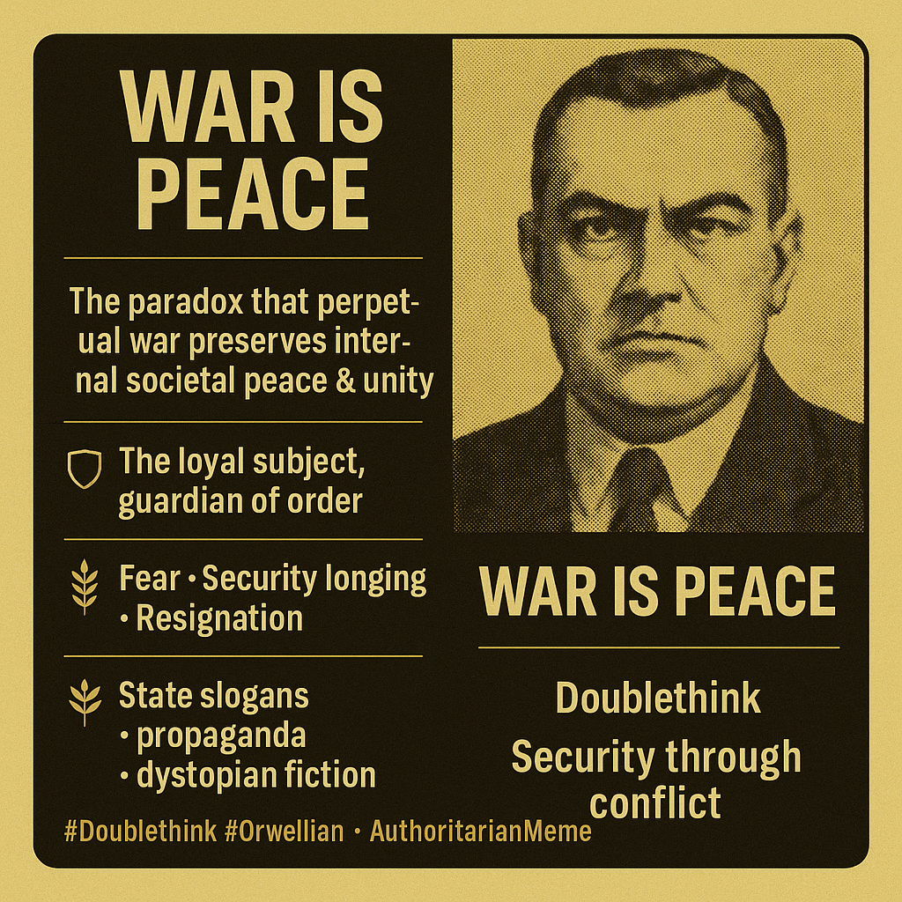

# Trump, Vance, and the Paradox of Peace: Decoding the 'Pro-Peace' Ticket's Doublethink.

Created at 2025/06/22 6:39 AM

**Mini-Memetic Profile**

**Title**: WAR IS PEACE — *The Paradox of Control*

**🧠 Core Idea Unit:**

- The essential “thought-virus” is the weaponized paradox: the notion that constant conflict ensures societal harmony. It rewires cognition by collapsing opposites, making ideological compliance feel like moral clarity.

**🎭 Identity Play & Roles:**

- Positions the user as the loyal subject, protector of order, or passive recipient of truth.
- Dissenters become heretics, traitors, or threats to peace.

**💥 Emotional Triggers:**

- Fear (of chaos, enemies, collapse)
- Security longing (desire for peace and safety)
- Resignation (helplessness in the face of institutional control)
- False empowerment (feeling of being on the “right” side of a binary)

**📡 Spread Mechanics:**

- Distribution vectors: Slogans, propaganda, dystopian fiction, military rhetoric, political speeches.
- Propagation style: Paradox, satire, ritual repetition, and authoritative command.

**🛡️ Defense Reflexes:**

- Thought-stopping logic: Paradox disorients rational challenge.
- Pre-dismissal of dissent: Critics seen as naive, dangerous, or unpatriotic.
- Moral framing: War framed as necessary sacrifice for the greater good.

**🧬 Memeplex Anchor Points:**

- Totalitarian ideologies, militarist statecraft, surveillance systems, Orwellian dystopias, realpolitik, and security-driven propaganda ecosystems.

**🧠 Sticky Symbols or Quotes:**

- “WAR IS PEACE”
- “Doublethink”
- “Big Brother”
- Peace symbols fused with military imagery
- Echoes of “Si vis pacem, para bellum” (“If you want peace, prepare for war”)

**🏷️ Tags:**

#Doublethink #Orwellian #DystopiaCore #ControlLogic #MilitarizedPeace #AuthoritarianMeme #SecurityParadox #1984Aesthetics #CognitiveDissonanceTech

[x/ddrrnt in Memescape](https://x.com/ddrrnt/status/1936781882685001875?s=46&t=7Z-E-ACnGlzdI-iyUwNCrQ)

[s/MemeticCowboy](https://substack.com/@memeticcowboy/note/c-128266583)

## Resources
- https://object.me.bot/front-img/note/attachments/img/1750599536473/IMG_4781.JPG
- https://object.me.bot/front-img/note/attachments/img/1750599536474/IMG_4780.JPG
- https://object.me.bot/front-img/note/attachments/img/1750599536475/5967CCE9-496C-423C-8027-521AA1727765.png

## Insight
Hey there! Given your knack for spotting patterns and your interest in how ideas spread, this image should be right up your alley. It's like a real-world example of those memetic profiles you're so into!

*   **The Paradox of Peace Through Strength**: The phrase "WAR IS PEACE" encapsulates the concept that a state of perpetual conflict can be used to maintain internal social order and unity. This idea is deeply rooted in the belief that having an external enemy justifies internal control and sacrifice, fostering a sense of collective identity and purpose. The image of a political ticket labeled "THE PRO-PEACE TICKET" juxtaposes this concept, suggesting that even those who advocate for peace may do so through policies that involve military strength or intervention.

*   **Doublethink and Cognitive Dissonance**: The hint mentions "Doublethink," a term coined by George Orwell in *1984*, which refers to the ability to hold two contradictory beliefs simultaneously and accept both of them. This is visually represented in the meme where an individual, seemingly aligned with a "Make America Great Again" ideology, switches from "No New Wars" to "I ❤️ Bombing Iran." This illustrates how easily individuals can be swayed to support conflicting ideas, especially when driven by emotional triggers like fear or security longing, as highlighted in the hint.

*   **Emotional Manipulation and Propaganda**: The "Mini-Memetic Profile" emphasizes emotional triggers such as fear, security longing, and resignation as tools to manipulate public opinion. The image of the political figures, combined with the "PRO-PEACE" label, can be seen as a form of propaganda that aims to reassure voters while potentially masking more aggressive foreign policy intentions. This aligns with the hint's description of how propaganda uses paradox, satire, and authoritative command to propagate its message.

*   **The Role of the Loyal Subject**: The hint describes how such messaging positions the user as a "loyal subject" or "protector of order." This is evident in the meme where the individual's internal switch is controlled by an external "red hand," symbolizing how easily people can be manipulated into supporting actions that contradict their initial beliefs. This dynamic reinforces the idea that questioning the status quo is seen as disloyal or dangerous, thus maintaining the established power structure.

*   **Historical Context and "Si vis pacem, para bellum"**: The hint references "Si vis pacem, para bellum" ("If you want peace, prepare for war"), a Latin adage that has been used throughout history to justify military buildup. This concept is directly related to the idea of "WAR IS PEACE," suggesting that military strength is necessary to deter aggression and maintain peace. The images, particularly the political ticket, evoke this historical context by implying that a strong military stance is essential for achieving peace, even if it involves engaging in conflict.

