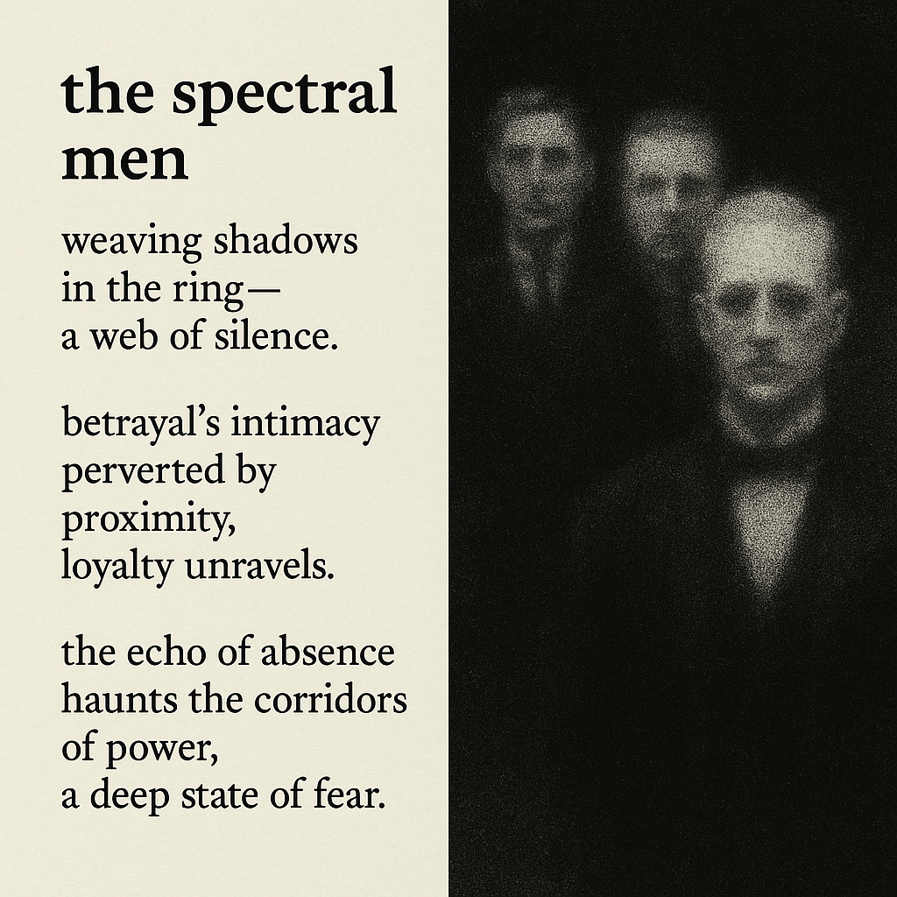

# Shadows of Betrayal and Silence

Created at 2025/10/20 12:33 PM

**Mini-Memetic Profile: “The Spectral Men”**

∴ **Core Idea Unit:** “The Spectral Men” encodes the belief that hidden male power networks—interwoven across politics, academia, tech, and royalty—operate through silence, complicity, and selective exposure. It transforms the conspiracy trope into a haunting moral allegory of institutional rot.

▲ **Identity Play & Roles:** Positions the speaker as the *Witness* or *Truth-Bearer*—haunted yet resolute—against a cabal of untouchable elites. Viewers become *Seers in the Shadow Theatre*, invited to pierce illusion and name what others dare not.

≈ **Emotional Triggers:** 😨 Fear — invisible power structures 😡 Outrage — complicity and injustice 😢 Grief — betrayal by trusted figures 🤯 Recognition — the unseen made legible

𐂷 **Spread Mechanics:**

- **Distribution Vectors:** X threads, Substack exposés, true-crime podcasts, survivor interviews, digital noir aesthetics.
- **Propagation Style:** Hauntological revelation—slow, poetic, uncanny truth-telling; less rant, more elegy.

⛨ **Defense Reflexes:** Irony is minimal; protection lies in *moral gravity* and *witness authority.* “You weren’t there—we were” creates epistemic immunity.

☷ **Memeplex Anchor Points:** #EpsteinNetwork · #DeepState · #ElitePredation · #Hauntology · #FeministReckoning · #InstitutionalDecay

✶ **Sticky Symbols or Quotes:**

- “Weaving shadows in the ring.”
- “A web of silence.”
- “The echo of absence.”
- “A deep state of fear.”

∿ **Tags:** #HauntedPower · #WitnessMemetics · #ShadowState · #FeministHauntology

## Resources
- https://object.me.bot/front-img/note/attachments/img/1760988806161/A3C1CDC2-984B-4072-B735-2A34736B5DE5.png

## Insight

* The image visually encapsulates the idea of "The Spectral Men" through its use of shadowy figures, evoking themes of hidden power and uncertainty. This aligns with the notion of invisible networks that exert influence while remaining veiled from public scrutiny, emphasizing the haunting quality of the text.

* The phrases "weaving shadows in the ring" and "a web of silence" effectively illustrate the complexities of complicity within elite circles. This mirrors real-world discussions about institutional corruption, where trust is systematically eroded; examples abound in investigative journalism exposing high-level misconduct.

* The emotional triggers presented in the hint—fear, outrage, grief, and recognition—resonate deeply with contemporary audiences, particularly in the wake of scandals involving secrecy at the highest levels of society. The imagery reflects this by creating an unsettling atmosphere, compelling viewers to confront uncomfortable truths.

* The concept of the "Witness" serves as a poignant reminder of the moral responsibility to expose injustices. Similar to the role of whistleblowers—like Edward Snowden or Chelsea Manning—this perspective invites a collective reckoning with the implications of silence versus transparency in power dynamics.

* The design and thematic resonance echo the aesthetics of digital noir and hauntology, both of which interrogate the breakdown of trust and the shadows that linger in societal frameworks. Visual elements that evoke ambiguity and a sense of the uncanny invite deeper exploration of these narratives and their real-life parallels.

* The "echo of absence" phrase poignantly captures the lingering impact of betrayal and the loss of innocence regarding trusted figures, a sentiment that parallels ongoing movements advocating for accountability and reform in various institutions, from finance to politics, reinforcing the urgency of this dialogue.
