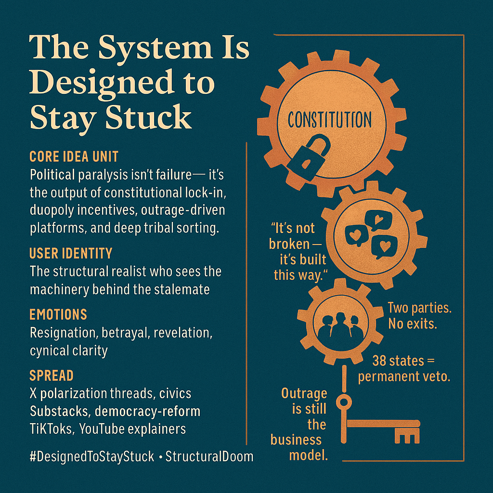

# Understanding Political Paralysis: A Structured Reality

Created at 2025/11/15 11:13 AM

**Mini-Memetic Profile: The System Is Designed to Stay Stuck**  🧠 Core Idea Unit  The sense of political paralysis isn’t failure — it’s the predictable outcome of a constitutional design that’s unchangeable, parties that profit from division, platforms that amplify outrage, and a society that has self-sorted into mutually unintelligible tribes. Stuckness is not an accident; it’s the operating logic.  🎭 Identity Play & Roles  Positions the viewer as the level-headed structural realist, someone who sees beneath partisan drama to the machinery that makes change nearly impossible. The “average citizen” becomes a captive inside a system built for gridlock.  💥 Emotional Triggers  😞 Resignation 😡 Institutional betrayal 🤯 Structural revelation 🧊 Fatalistic calm (“of course it’s stuck… it’s supposed to be”) 🧠 Cynical clarity  📡 Spread Mechanics  Distribution: X threads on polarization, Substack essays on reform, civics TikToks, longform YouTube explainers. Propagation Style: Quiet doom, structural inevitability, “constitutional math meets platform dynamics.” It spreads as a diagnosis that feels like fact rather than opinion.  🛡️ Defense Reflexes  • Shifts the conversation from partisan blame to design constraints (38-state amendment wall, Senate malapportionment). • Preempts “can’t we all just get along?” with incentive loops (party primaries, platform engagement). • Frames optimism as misunderstanding the machinery. • Hides behind non-negotiable facts (constitutional structure, algorithmic incentives, geographic sorting).  🧬 Memeplex Anchor Points  📜 Frozen Constitution / Amendment lock-in ⚙️ Two-party duopoly incentives 🔥 Engagement-maximizing outrage economy 🧠 Affective tribal sorting 🌀 Political doom loops  🧠 Sticky Symbols & Quotes  • “It’s not broken — it’s built this way.” • “38 states = permanent veto.” • “Two parties. No exits.” • “Outrage is still the business model.” • Symbol: locked gears turning endlessly but moving nothing.  🏷️ Tags  #DesignedToStayStuck · #NoExitPolitics · #StructuralDoom · #DemocracyDesign  ⸻ [x/Change w/RedearnMike and SIN](https://x.com/redfearnmike/status/1989761466178699601?s=46&t=7Z-E-ACnGlzdI-iyUwNCrQ) 

## Resources
- https://object.me.bot/front-img/note/attachments/img/1763234018058/336DC07F-9DFB-445D-ADA1-5558FF636435.png

## Insight

* The depiction presents a critical view of systemic political dysfunction as a feature, not a bug, emphasizing the inevitability of gridlock due to constitutional design and entrenched party dynamics. This aligns with observations in political theory that institutions significantly shape political behavior and outcomes, often leading to stagnation in reform efforts.  

* Framing the "average citizen" as a captive in a gridlocked system speaks to the concept of political alienation. Scholars like Robert Putnam in "Bowling Alone" have discussed how civic engagement diminishes when individuals feel powerless within unresponsive structures, leading to a disillusioned electorate that may withdraw from participation.  

* The suggested emotional responses—resignation, betrayal, and cynicism—mirror the sentiments often found in postmodern political discourse, where the focus shifts to structural limitations rather than individual agency. This reflects a growing academic consensus that recognizes the import of disillusionment in shaping political engagement and public sentiment.  

* The highlighted mechanisms of propagation—social media threads, essays, and platforms—suggest a modern approach to engaging citizens in political discourse through digital means. This mirrors the work of scholars like Sherry Turkle, who explores how technology alters our engagement with society and politics, often amplifying feelings of isolation despite increased connectivity.   

* Lastly, the imagery of "locked gears" symbolizes the stagnation inherent in the political system. This metaphor resonates with literature on political inertia, where entrenched interests maintain the status quo, rendering progress nearly impossible. Notably, Francis Fukuyama in "Political Order and Political Decay" analyzes how institutional frameworks can lead to varying degrees of effectiveness, often resulting in minimal reform.
