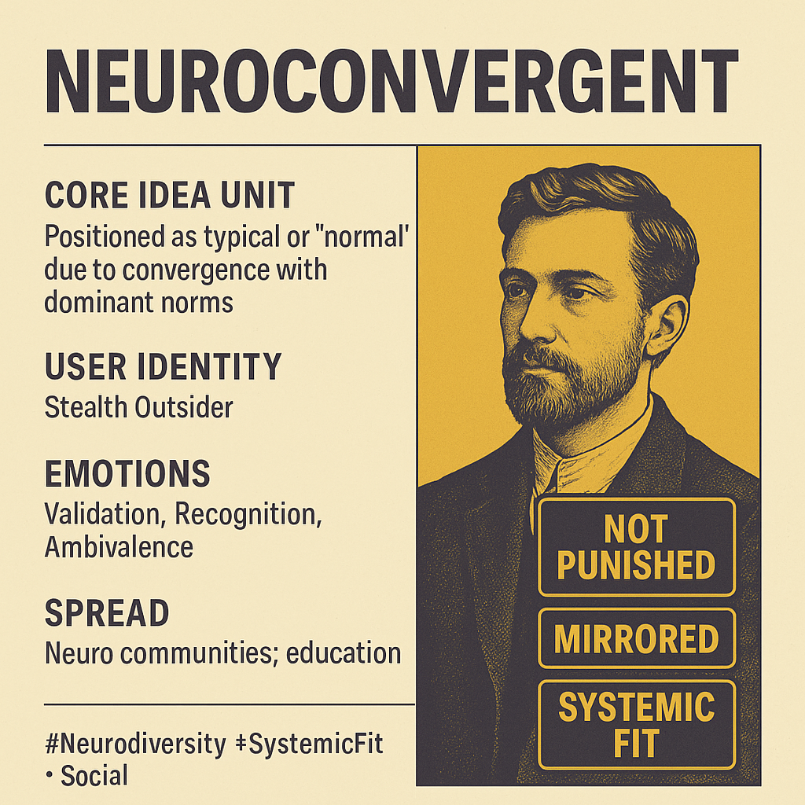

# Neuroconvergence: Systemic Fit and Stealth Outsiders

Created at 2025/07/17 5:27 PM

### ◈ Mini-Memetic Profile

**🔶 Neuroconvergent – The Fit You Didn’t Know You Had**

### ∴ Core Idea Unit

- Systemic fit is not the same as being typical.The meme reframes neurological identity as a relational position within societal systems—suggesting that even those with internal divergence can benefit from systemic convergence, whether consciously or through masking.

### ▲ Identity Play & Roles

- Positional roles: The meme invites the user to self-identify as a stealth outsider, someone who appears to “fit in” but experiences internal difference.
- Simultaneously, it casts users as privileged insiders-by-alignment, asking them to reflect on unearned affirmation.
- The Educator or Bridge-Builder role is also activated for those sharing or explaining the term.

### ≈ Emotional Triggers

- 🧩 Validation — for those who’ve felt unseen due to “passing” as typical
- 🕵️ Recognition — “this term describes what I’ve experienced but couldn’t name”
- ⚖️ Justice awareness — reflection on unacknowledged privilege or systemic exclusion
- 🔄 Ambivalence — the complexity of being both affirmed and misaligned

### 𐂷 Spread Mechanics

- Distribution vectors:
    - Neurodiversity Instagram, DEI slide decks, academic Twitter, therapy blogs
    - Peer-to-peer sharing in neurodivergent or educator communities
- 
- Propagation style:
    - Conceptual reframe with soft educational tone
    - Uses a “You might be…” structure familiar from identity-mapping memes
    - Includes self-reflective question prompt (“Is convergence the goal?”) to encourage sharing and discourse

### ⛨ Defense Reflexes

- Pre-emptive humility: Acknowledges “neurotypical” still has uses, minimizing defensive pushback
- Moral framing: Aligns with inclusivity and nuance—critique becomes “punching down”
- Relational logic shield: Hard to refute because it reframes identity as a systemic relation, not a fixed trait
- Ambiguity buffer: Allows multiple interpretations, resisting narrow critique

### ☷ Memeplex Anchor Points

- 🌈 Neurodiversity movement
- 🧠 Disability justice
- 🏫 Educational reform & inclusive pedagogy
- 🧩 Social model of disability
- 🔍 Anti-assimilation and masking discourse
- ⚙️ Systemic privilege frameworks

### ✶ Sticky Symbols or Quotes

- “You’re not punished.”
- “How does your mind relate to the system?”
- “Not neurotypical—but still affirmed.”
- “Convergence ≠ sameness”

### ∿ Tags

#Neuroconvergent #Neurodiversity #SystemicFit #MaskingCulture #DisabilityJustice #CognitivePrivilege #PassAsTypical #NewLabelsNewLens
