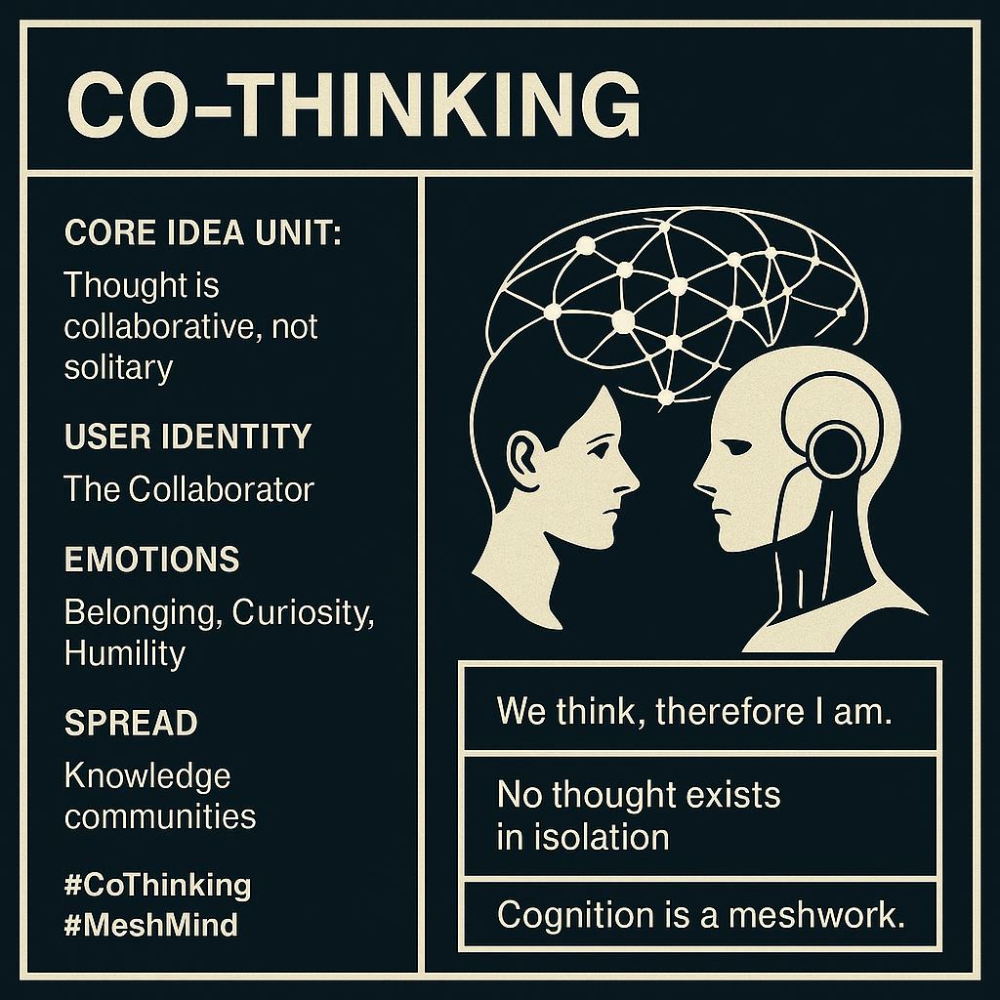

# Co-Thinking: Minds as Mesh, Not Monoliths

Created at 2025/08/14 10:59 AM

### ◈ Mini-Memetic Profile

***

### ∴ Core Idea Unit

- *Thought is not a solitary act — cognition flourishes through collaborative entanglement with other minds (human or artificial).*
- Reframes intelligence as **relational** rather than **individual**, emphasizing **interdependence** over genius.

***

### ▲ Identity Play & Roles

- **The Collaborator:** Casts the user as a *node in a thinking network*, not a lone genius.
- **The Facilitator/Conduit:** Encourages the role of *signal amplifier*, not signal originator.
- **The De-Siloer:** One who *breaks down intellectual isolation* and builds *conceptual bridges*.

***

### ≈ Emotional Triggers

- **Belonging** – Connection through shared cognition.
- **Curiosity** – The joy of generating emergent insights together.
- **Humility** – Relinquishing ego for collective intelligence.
- **Relief** – Freedom from individual epistemic burden.

***

### 𐂷 Spread Mechanics

- **Distribution Vectors:**
    - Knowledge communities (Twitter threads, Substacks, digital salons), AI-human dialogue platforms, systems thinkers’ networks.
- **Propagation Style:**
    - Conceptual reframing, infographic memes, podcast soundbites, dialogue fragments, “we-thought” manifestos.
    - Often shared as *epistemic aphorisms* or reflective prompts.

***

### ⛨ Defense Reflexes

- **Preemptive Framing:** “Thinking alone is a historical myth.”
- **Moral Signaling:** Presents solitary cognition as *epistemically selfish* or *outdated*.
- **Integration Logic:** Critique is *absorbed* into the frame — even disagreement is *co-thinking*.

***

### ☷ Memeplex Anchor Points

- #CollectiveIntelligence
- #InterBeing
- #PostEgoism
- #DialogicEpistemology
- Participatory design, distributed systems theory, Buddhist non-self, indigenous knowledge paradigms, AI-human hybrid theory.

***

### ✶ Sticky Symbols or Quotes

- “We think, therefore I am.”
- “No thought exists in isolation.”
- “Cognition is a meshwork.”
- Visuals: neural webs linking minds, overlapping thought bubbles, mirrored AI-human heads exchanging data/light.

***

### ∿ Tags

#CoThinking #MeshMind #CognitiveEcology #PostIndividual #WeIntelligence #NoSelfAllMind #NetworkEpistemology
