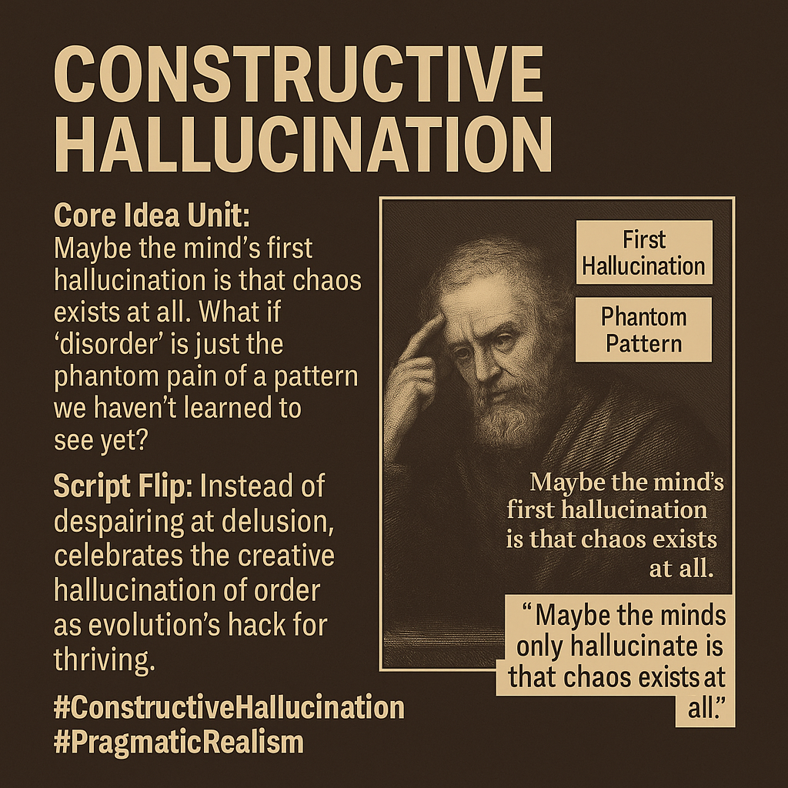

# Constructive Hallucination: Order from Perceived Chaos

Created at 2025/08/20 7:28 AM

**📌Mini-Memetic Profile**

**Title: Constructive Hallucination**

Also see: [Hallucinated Order](https://app.me.bot/memory/ICAES7KNXVS1RDY2)

🧠 Core Idea Unit:

- The perception of chaos may itself be the illusion; order is not false but emergent—our mind’s creative structuring is a feature, not a flaw.
- Delusion is reframed as adaptive pattern recognition: evolution’s aesthetic hack for thriving in complexity.

🎭 Identity Play & Roles:

- Positions the user as a Pattern Alchemist, Optimistic Realist, or Meaning-Crafter.
- Implies elevated status as one who sees hallucination not as deception but design—co-creating meaning with the cosmos.

💥 Emotional Triggers:

- Awe at hidden coherence.
- Empowerment through epistemic agency.
- Playful irony in embracing illusion as generative.

📡 Spread Mechanics:

- Distribution vectors: 
    - High-concept memes, futurist forums, systems thinking channels, visionary art communities.
- Propagation style: 
    - Conceptual inversion, poetic paradox, speculative insight.

🛡️ Defense Reflexes:

- Frame Inversion Shield: Critiques of delusion are flipped—illusion is the mechanism of discovery.
- Pragmatic Immunity: Utility trumps truth—if the hallucination works, it’s valid.
- Evolutionary Framing: Disarms critique by grounding in adaptive survival logic.

🧬 Memeplex Anchor Points:

- Evolutionary epistemology.
- Constructivist philosophy.
- Pragmatism (William James, Richard Rorty).
- Panpsychism, systems thinking, complexity theory.
- Visionary science fiction (e.g. Solarpunk, Hyperstition).

🧠 Sticky Symbols or Quotes:

- “Maybe the mind’s first hallucination is that chaos exists at all.”
- “Phantom pain of a missing pattern.”
- Constructive hallucination (paradoxical anchor phrase)
- Visuals of fractals, neural maps, cosmic geometry, artist/scientist hybrids.

🏷️ Tags:

#ConstructiveHallucination #PragmaticRealism #PatternAlchemy #MythicSystems #CreativeEpistemology #EvolutionaryMind

## Resources
- https://object.me.bot/front-img/note/attachments/img/1755700092209/4F4EA282-D3E6-4649-8B60-86D4DD05894D.png

## Insight

*  **The Core Idea of Constructive Hallucination**: The image presents the concept that our perception of chaos might be a misinterpretation. It suggests that what we perceive as disorder could be the "phantom pain" of a pattern we haven't yet grasped. This idea challenges the conventional view of hallucinations as purely negative or deceptive, reframing them as a potential mechanism for discovering underlying order.

*  **Script Flip: Embracing Creative Hallucination**: Instead of viewing delusion negatively, the image encourages celebrating the "creative hallucination of order" as an evolutionary advantage. This perspective aligns with constructivist philosophy, which posits that individuals actively construct their understanding of the world rather than passively receiving it.

*  **Pragmatic Realism**: The inclusion of the hashtag "#PragmaticRealism" suggests a philosophical grounding in pragmatism, particularly the ideas of William James and Richard Rorty. Pragmatism emphasizes the practical consequences of beliefs and theories, suggesting that if a "hallucination" leads to positive outcomes or helps us navigate the world more effectively, it holds value regardless of its objective truth.

*  **Visual Representation and Historical Context**: The image includes a portrait of a bearded man, possibly a philosopher or scientist, which adds a layer of historical and intellectual depth to the concept. This visual anchor could be interpreted as a nod to the historical figures who have grappled with questions of perception, reality, and the nature of knowledge.

*  **Memetic Propagation and Defense**: Drawing from the hint, the concept of "Constructive Hallucination" can be seen as a meme with specific propagation and defense mechanisms. Its spread relies on conceptual inversion and poetic paradox, appealing to those in futurist forums, visionary art communities, and systems thinking channels. Defensively, it uses frame inversion to counter critiques of delusion, arguing that illusion is a tool for discovery, and employs pragmatic immunity, asserting that the utility of a hallucination validates it.

