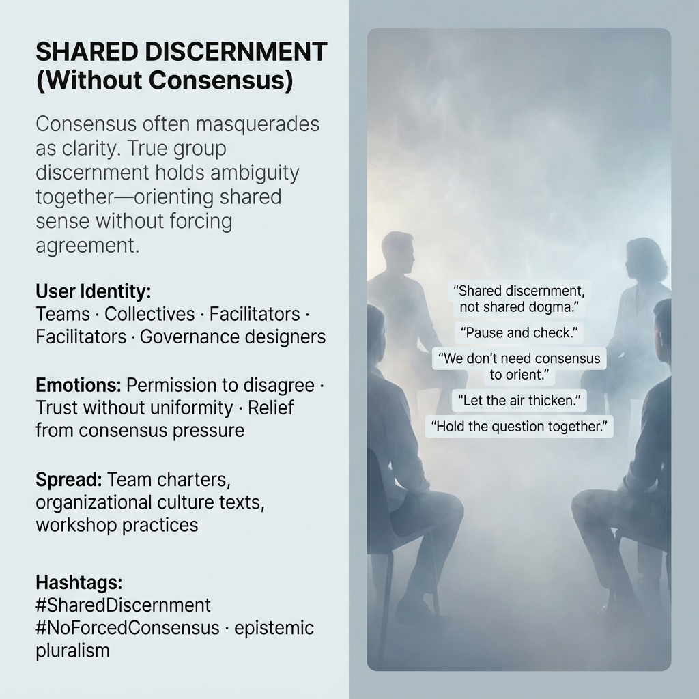

# Embracing Shared Discernment Without Consensus

Created at 2025/12/18 9:25 PM

## 🧩 **Shared Discernment (Without Consensus)**

***

### ∴ Core Idea Unit

Consensus often masquerades as clarity, collapsing difference to relieve tension.True group discernment holds ambiguity *together*—orienting shared sense without forcing agreement.

**Mental shift provoked:**From *“we must agree to move”* → *“we can orient without convergence.”*

***

### ▲ Identity Play & Roles

**Cast as:** Team member · Facilitator · Collective sense-maker · Governance designer

The meme positions participants not as voters or debaters, but as *co-attuners*—trusted to hold their perspective without demanding dominance or surrender.

***

## ≈ Emotional Hooks & Cognitive Levers

- 🤝 Permission to disagree without fracture
- 🌬️ Trust without uniformity
- 🧭 Relief from consensus pressure
- 🫁 Calm that comes from shared pause

These levers dissolve coercive harmony and reopen group intelligence.

***

### 𐂷 Spread Mechanics

**Distribution vectors:**

- Team charters and collaboration norms
- Organizational culture documents
- Facilitation and workshop practices
- Governance design frameworks

### 𐂷 Spread Mechanics

style:**Process-oriented, procedural, quietly radical. Often embedded as language for pauses, check-ins, and reflection loops rather than declarations.

***

### ⛨ Defense Reflexes

- Resists authority capture by refusing forced agreement
- Deflects polarization by legitimizing multiple orientations
- Immune to critiques demanding “alignment now”

The meme holds because it treats tension as signal, not failure.

***

### ☷ Memeplex Anchor Points

- Epistemic pluralism
- Anti-authoritarian collaboration
- Collective sense-making
- Process ethics
- Elemental Air (shared atmosphere of noticing)

***

### ✶ Sticky Symbols or Quotes

- “Shared discernment, not shared dogma.”
- “Pause and check.”
- “We don’t need consensus to orient.”
- “Let the air thicken.”
- “Hold the question together.”

***

### ∿ Tags

#SharedDiscernment · #NoForcedConsensus · #EpistemicPluralism · #CollectiveSensemaking · #ProcessOverAgreement · #AirElement

***

**Reflection anchor:**When the air thickens, don’t rush to clear it.Sometimes the group’s intelligence is forming *in the pause itself*.
