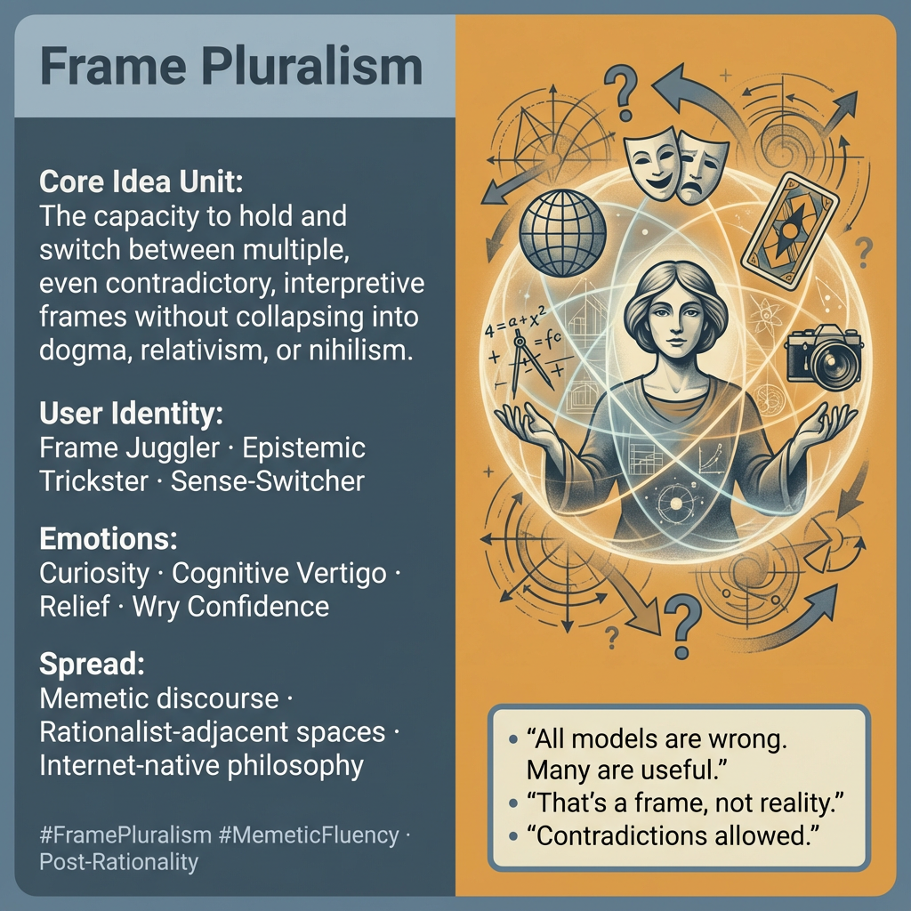

# Embracing Frame Pluralism for Adaptive Intelligence

Created at 2026/01/16 2:49 PM

## **Title**

**Frame Pluralism**

***

### ∴ Core Idea Unit

Reality cannot be captured by a single interpretive frame without distortion.Holding multiple, even contradictory frames simultaneously is not confusion—it is adaptive intelligence.

**Mental shift provoked:**From *frame loyalty* → *frame literacy*From asking “Which frame is true?” → “Which frames are doing work here, and for whom?”

***

### ▲ Identity Play & Roles

**Cast Role:** *Frame Juggler / Sense-Switcher / Epistemic Trickster*

The meme positions the user as someone who:

- can step in and out of lenses without identity collapse
- is not owned by any single narrative
- treats beliefs as instruments, not vows

**Repositioning:**Self moves from *inhabitant of a worldview* → *operator of a frame stack*.

***

### ≈ Emotional Triggers

- 🧠 Curiosity (what else could be true at once?)
- 🌀 Cognitive vertigo (contradictions held without resolution)
- 😌 Relief (permission to stop pretending one story explains everything)
- 😏 Subtle superiority (fluency across camps without full capture)

These emotions reward flexibility and weaken the drive toward dogma.

***

### 𐂷 Spread Mechanics

**Distribution Vectors**

- Longform blog posts, Substack essays
- X / Twitter threads mapping “lenses”
- Discord servers, rationalist-adjacent salons
- Meme diagrams comparing frames side by side

### 𐂷 Spread Mechanics

**Style**

- Meta-analysis
- Irony with competence
- Comparative tables and lens-swapping demos
- “Yes, *and*” rather than “No, but”

***

### ⛨ Defense Reflexes

- **Anti-dogma shield:** Any critique is reframed as “that’s one lens”
- **Irony buffer:** Prevents capture by moral outrage
- **Meta-positioning:** Stands one level above most objections

This makes the meme resilient—but also hard to falsify.

***

### ☷ Memeplex Anchor Points

- Memetics & cultural evolution
- Post-rationality / epistemic volition
- Narrative therapy & identity play
- Systems thinking & complexity science
- Internet “pill” taxonomies (as lenses, not truths)

Frame Pluralism thrives where reality feels overdetermined and single stories keep failing.

***

### ✶ Sticky Symbols or Quotes

/ Phrases**

- “All models are wrong, but many are useful”
- “That’s a lens, not reality”
- “Frame literacy > frame loyalty”
- “Contradictions are allowed”
- Juggling / switching metaphors

These phrases normalize non-closure while signaling sophistication.

***

### ∿ Tags

#FramePluralism · #MetaCognition · #MemeticFluency · #PostRationality · #EpistemicAgency · #CowboyEnergy

***

**Reflection anchor:**This meme reinforces a loop of *epistemic agility*. Its risk is drift into endless meta without commitment; its strength is resisting capture in a world where every frame eventually hardens into a trap.
