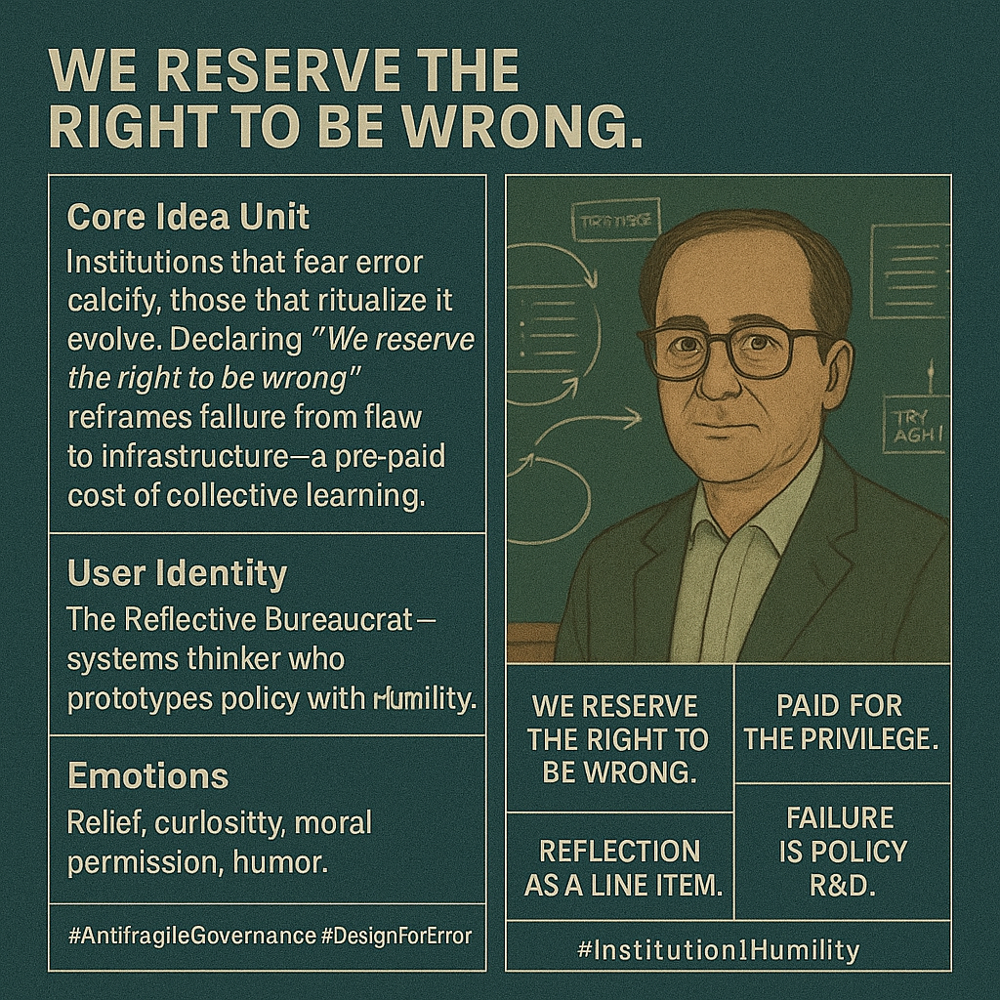

# Embracing Error: Uncertainty as Civic Asset

Created at 2025/11/11 10:18 PM

 **“We Reserve the Right to Be Wrong”**   Joe Forpeter, fifty-one, chaired the Capital Projects Committee in a rust-belt county that still paved roads with five-year plans. Every March, engineers marched in with Gantt charts in full color, promising the new courthouse would open “on time, on budget, no surprises.” The county exec loved the slide deck; the bridge collapsed in year six anyway. Joe saw the schizophrenia: certainty was the ticket to funding, learning was the fine print nobody read.  He stopped coaching “psychological safety” and started rewriting the charter. His amendment was two pages: every capital request over $2 million now carried a mandatory Uncertainty Budget—10% of total cost ring-fenced for scope pivots, plus a Pre-Mortem Panel of three citizens picked by lottery, one union rep, and one high-school senior. Their sign-off was required before the first shovel. The exec called it bureaucracy; Joe called it load-bearing humility.  First test: a $14 million flood wall. Engineers predicted 2.1-meter crest. Panel demanded stress tests at 2.8. Cost jumped $400k. The exec fumed. Spring storms hit 2.9 meters; the wall held. The overrun became a line item labeled “Saved the downtown.” Next cycle, departments begged for bigger uncertainty budgets—proof the ritual had flipped.  Joe never mentioned mindset. He just moved the decision rights downward and the time horizon outward. Reflection was no longer a soft skill; it was a line item with a purchase order. The county still paved roads, but now every contract carried a quiet clause: We reserve the right to be wrong, and we’ve already paid for the privilege.   **🧩 Mini-Memetic Profile — “We Reserve the Right to Be Wrong” (Antifragility as Policy)**  ⸻  🧠 Core Idea Unit  Institutions that fear error calcify; those that ritualize it evolve. Declaring “We reserve the right to be wrong” reframes failure from moral flaw to civic asset—a pre-paid cost of collective learning.  ⸻  🎭 Identity Play & Roles  Primary Role: The Reflective Bureaucrat — guardian of systems who dares to prototype openly. Supporting Archetypes: 	•	The Educator as Experimenter 	•	The Policy Designer as Philosopher 	•	The Innovation Lab Skeptic turned Believer  ⸻  💥 Emotional Triggers  🧠 Relief from perfectionism 😌 Permission to learn in public 😂 Gentle humor at bureaucratic absurdity 🔥 Pride in institutional humility  ⸻  📡 Spread Mechanics  Distribution Vectors: Public-sector design blogs, policy labs, civic innovation forums, LinkedIn infographics. Propagation Style: Earnest wit + systems thinking aesthetics — flow charts meet koans.  ⸻  🛡️ Defense Reflexes 	•	Pre-payment Logic: “We already budgeted for mistakes.” 	•	Meta-accountability: Turns error tracking into transparency theater. 	•	Moral Reversal: To be wrong is to care enough to test.  ⸻  🧬 Memeplex Anchor Points 	•	🧩 Antifragility as governance 	•	⚙️ Administrative experimentation 	•	📊 Learning economies over audit cultures 	•	🪞 Meta-reflection as organizational ritual  ⸻  🧷 Sticky Symbols / Quotes  “We reserve the right to be wrong.” “Paid for the privilege.” “Reflection as a line item.” “Failure is policy R&D.”  ⸻  🏷️ Tags  #AntifragileGovernance #InstitutionalHumility #ReflectiveBureaucracy #DesignForError #PolicyAsPrototype

## Resources
- https://object.me.bot/front-img/note/attachments/img/1762928333447/E4CAE344-4604-41E2-B504-E511BADB834B.png

## Insight

* The principle articulated as "We Reserve the Right to Be Wrong" embodies a transformative approach to governance, suggesting that recognizing and planning for potential errors can foster adaptability and growth. By framing mistakes not as failures but as integral to collective learning, institutions can evolve from traditional, rigid structures to more flexible and responsive ones, enhancing their overall efficacy. 

* The concept of the "Reflective Bureaucrat" applies here as a pivotal role within these institutions, as it encourages a culture of experimentation. This figure champions the idea that policy-making should include room for reflection and adjustment, allowing for innovative thinking and responses to unforeseen consequences, ultimately improving governance practices.

* Emotional triggers like relief from perfectionism and permission to learn in public are critical elements of this framework. Institutions that embrace a learning-oriented culture can alleviate the fear surrounding mistakes, fostering an environment where employees feel safe to take calculated risks and explore new ideas without the burden of rigid expectations.

* The financial concept of an "Uncertainty Budget" is particularly noteworthy. By allocating resources for potential missteps, organizations signal a commitment to proactive risk management rather than reactive crisis handling. This approach not only mitigates the impact of unforeseen challenges but also promotes transparency in decision-making processes.

* The design for error within governance highlights a shift towards antifragility—the ability to learn and grow from stressors. This notion encourages a departure from an audit culture that punishes mistakes, moving instead towards one that values experimentation, reflection, and iterative improvement as essential elements of effective policy development. 

* Additionally, the propagation of these ideas through public-sector design blogs and civic innovation forums indicates a growing trend towards collaborative governance. As more practitioners adopt "paid-for-the-privilege" mindsets, the landscape of public administration may increasingly reflect a commitment to humility and adaptability, making governance mechanisms more resilient over time.
