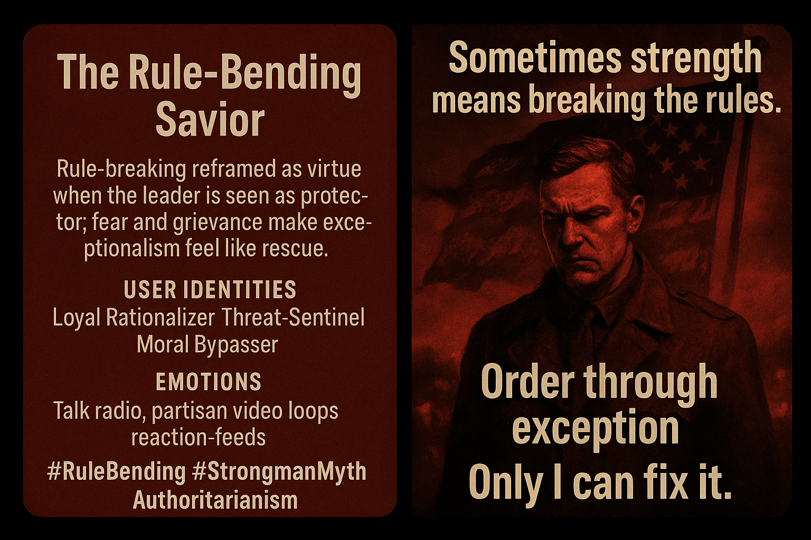

# Embracing Rule-Bending Leadership Myths

Created at 2025/11/21 10:39 AM

### **🧩 Title: The Rule-Bending Savior**

**More:** [Memetic Analysis: “Strong Leaders Bend the Rules”](https://memeticcowboy.substack.com/p/memetic-analysis-strong-leaders-bend)

### ∴ Core Idea Unit

Legitimacy shifts from law to charisma: rule-breaking is framed as moral clarity when performed by the “chosen” leader. Disorder makes exceptionalism feel like rescue.

### ▲ Identity Play & Roles

**The Loyal Rationalizer** — the follower who interprets transgression as courage.**The Threat-Sentinel** — scanning for enemies, rewarding decisive action.**The Moral Bypasser** — collapses process into outcome: “If he wins for us, it’s right.”

### ≈ Emotional Triggers

Anger (trait and situational), betrayal, fear, vindication, craving for order, awe before unapologetic dominance.

### 𐂷 Spread Mechanics

- **Distribution Vectors:** Talk radio, partisan video loops, political rallies, reaction-driven feeds, pastor-influencer sermons.
- **Propagation Style:** Righteous rhetoric, adversarial mythmaking, military-aesthetic imagery, “lawlessness for the greater good.”

### ⛨ Defense Reflexes

Irony shield: “You’re too naive for the real world.”Threat inflation: “You’ll understand when danger knocks.”Identity lock-in: dissent cast as betrayal of the group.

### ☷ Memeplex Anchor Points

Authoritarian populism · grievance politics · prophetic-savior archetypes · punitive theology · sovereignty maximalism · frontier mythos · masculine exceptionalism

### ✶ Sticky Symbols or Quotes

- “Sometimes strong leaders have to bend the rules.”
- “Only he has the courage to act.”
- “Law and order — by any means.”
- Visuals: flags, storms, military chic, lone rider silhouettes.

### ∿ Tags

#Authoritarianism #RuleBending #StrongmanMyth #PoliticalEmotions #NarrativePower #GrievanceCore #MythicTransgression
