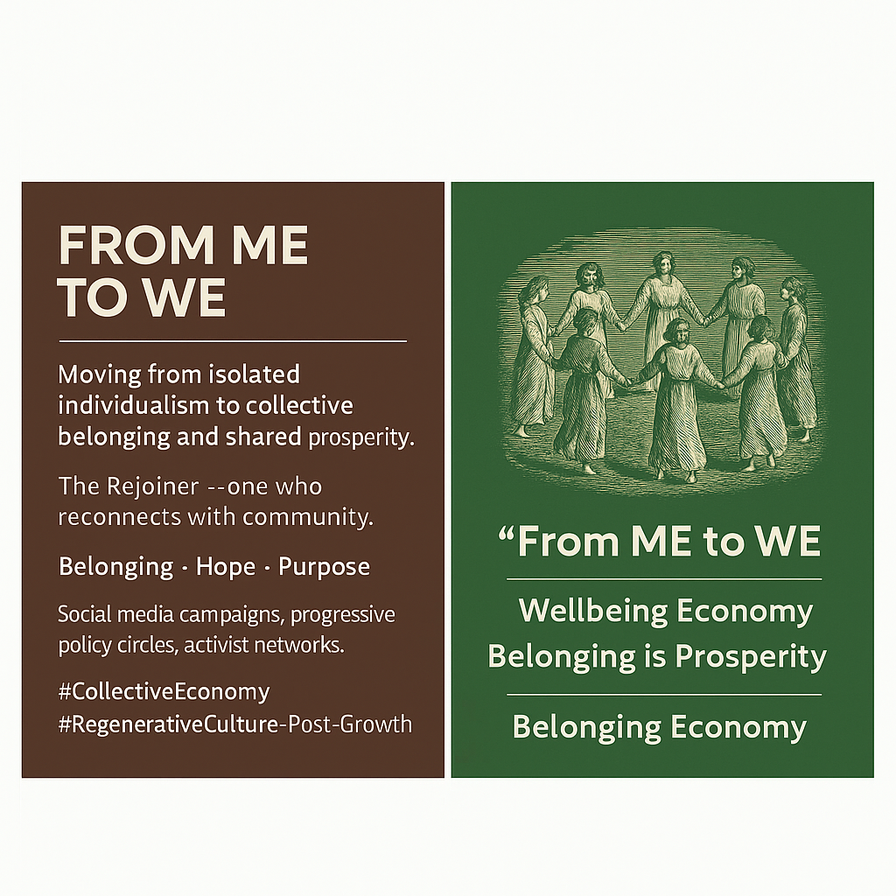

# From 'ME' to 'WE': Rejoining Community for a Wellbeing Economy and Shared Prosperity

Created at 2025/06/30 11:50 AM

### ◈ Mini-Memetic Profile

**Title:***From ME to WE — The Collective Wellbeing Reframe*

***

### ∴ Core Idea Unit

- The essential belief: *Individualism is inadequate; true prosperity comes from re-centering community and collective wellbeing.*
- Frame: *Moving from separation to belonging is both necessary and morally superior.*

***

### ▲ Identity Play & Roles

- **User as:**
    - The *Rejoiner* (one who leaves isolation for connection)
    - The *Insider* (part of a community awakened to a truer model of prosperity)
    - The *Moral Advocate* (promoting the wellbeing of all)

***

**❤️ Emotional Triggers:**

- Belonging
- Hope
- Nostalgia for community
- Mild moral urgency

***

### 𐂷 Spread Mechanics

- **Distribution vectors:**
    - Social media (hashtags, shareable slogans)
    - Policy documents
    - Thought-leader newsletters and talks
- **Propagation style:**
    - Direct claim ("We must move from ME to WE")
    - Call-to-action (adopt new terminology)
    - Emotional resonance over factual argument

***

### ⛨ Defense Reflexes

- **Moral framing:** Critique implies selfishness or regression.
- **Binary logic:** You are either stuck in "ME" or evolving to "WE."
- **Virtue association:** Adoption signals moral alignment.

***

### ☷ Memeplex Anchor Points

- Post-growth economics
- Care economy and regenerative movements
- Anti-neoliberal critique
- Community-focused spiritual and ecological narratives

***

### ✶ Sticky Symbols or Quotes

- *From ME to WE*
- *Wellbeing Economy (WE)*
- *Connection and belonging*
- Visual: Arrows pointing from “ME” to “WE”

***

### ∿ Tags

#CollectiveEconomy #FromMEtoWE #RegenerativeNarrative #BelongingMeme #PostGrowth
