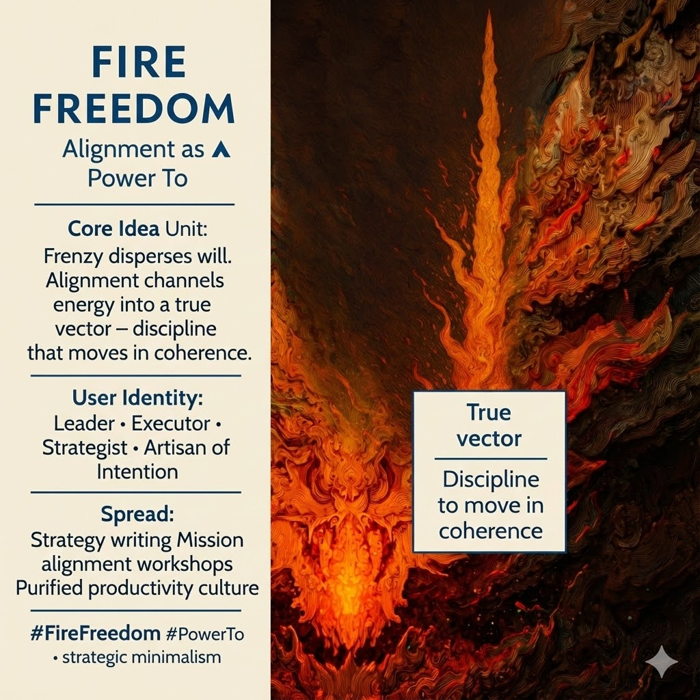

# Harnessing Energy Through Strategic Alignment

Created at 2025/12/14 12:28 PM

## **Fire Freedom: Alignment as Power To** ▲

***

## ∴ Core Idea Unit

Unchecked motion disperses will. Frenzy feels powerful but produces waste. **Fire Freedom reframes power as alignment** — channeling will into a *true vector* so energy moves with precision, not compulsion.

**Resolution frame:** Discipline is not suppression. It is **the art of letting energy travel far without burning itself out**.

**Mental shift provoked:** From *“How do I do more?”* → *“What single direction deserves my fire?”*

***

## ▲ Identity Play & Roles

**Cast the viewer as:**

- **Leader** — heat without chaos
- **Executor** — decisive without frenzy
- **Strategist** — motion guided by intent
- **Artisan of Intention** — shaping force into form

**Repositioning:** The self becomes a **vector**, not a blast radius.

***

## ≈ Emotional Hooks & Cognitive Levers

- 🔥 **Motivational Heat with Control** — passion that doesn’t consume
- 🧯 **Anti-Burnout Clarity** — less effort, more movement
- 🗡️ **Virtue of Restraint** — strength proven by precision

This meme redeems discipline from shame and reframes it as **care for energy**.

***

## 𐂷 Spread Mechanics

**Distribution Vectors**

- Productivity culture (purified of grind)
- Strategy and execution writing
- Mission-alignment workshops
- Creative and craft-based leadership spaces

**Propagation Style**

- Sharp contrasts (heat vs scatter)
- Vector metaphors
- Minimalist action language

***

## ⛨ Defense Reflexes

- **Anti-Hustle Shield:** More motion ≠ more progress
- **Anti-Passivity Guard:** Alignment still moves decisively
- **Anti-Moralism Lock:** Discipline framed as efficiency, not virtue signaling

Critique must explain **why scattered effort outperforms aligned force** — rarely defensible.

***

## ☷ Memeplex Anchor Points

- Purpose ethics
- Strategic minimalism
- Anti-compulsion psychology
- Craft discipline traditions
- IF-Prime elemental Fire (▲)

***

## ✶ Sticky Symbols / Quotes

- ▲ **FIRE**
- 🧭 *True vector*
- 🔥➡️🎯 *Embers → trajectory*
- 🛠️ **“Discipline to move in coherence.”**
- ⚡ **Power: To**

***

## ∿ Tags

#FireFreedom · #Alignment · #PowerTo · #StrategicMinimalism · #AntiBurnout · #IFPrime

***

**Reflection anchor:** This meme doesn’t ask you to suppress your fire. It asks **whether your fire knows where it’s going — and whether it can get there intact.**

## Resources
- https://object.me.bot/front-img/users/send/img/1765744112595_c4zhf/unnamed_%2831%29.jpg

## Insight

* The core concept of "Fire Freedom" emphasizes the importance of channeling energy effectively, moving away from chaotic frenzy towards disciplined alignment. This resonates with principles found in various leadership and productivity frameworks, where focus is seen as a crucial determinant of success. 

* The distinction between discipline as suppression and as a guiding force is profound. This shift in perspective aligns with psychological studies on motivation, which suggest that autonomy and purposeful action foster greater engagement than mere exertion without direction.

* Characters identified in the content—such as the Leader, Executor, and Strategist—reflect different dimensions of effective collaboration and individual roles in a collective setting. This aligns with modern organizational behavior theories that advocate for role clarity, enhancing both individual and team performance.

* The emotional hooks outlined in the framework, especially around anti-burnout and intentional movement, resonate with concepts from well-being literature, where balance and purpose are critical in sustaining long-term motivation and avoiding fatigue in high-performance contexts.

* The call to prioritize a "true vector" serves as a metaphor for precision in targeting efforts, reminiscent of strategic frameworks like OKRs (Objectives and Key Results), which emphasize clarity in goals and alignment across teams. 

* Utilizing the content's imagery and symbolism can be effective in workshops and training settings, helping participants visualize energy alignment and the transformative power of deliberate, focused action. This could be contextualized in creative leadership spaces that thrive on clarity and strategic minimalism.
