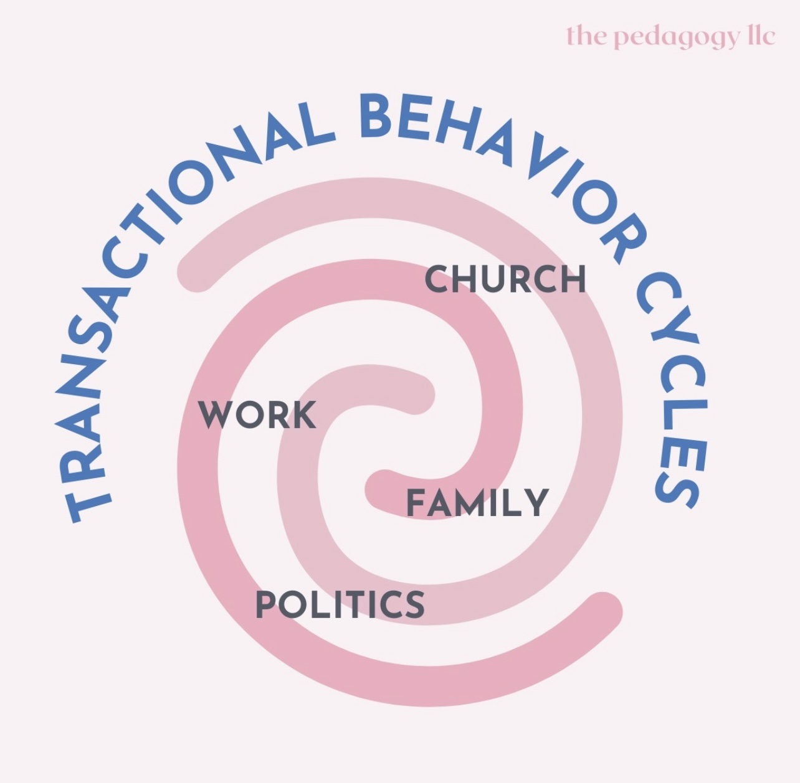

# Institutional Spiral: Transactional Behavior Cycles Trap

Created at 2025/07/18 2:36 PM

Mini-Memetic Profile

Title: Trapped in the Spiral: Institutional Performance Loops

🧠 Core Idea Unit:

- Life in modern society is dominated by transactional behavior cycles across institutions (work, church, politics, family), which mold identity through repetitive, performative roles.
- Escape or authenticity is difficult within systems that reward conformity and role maintenance.

🎭 Identity Play & Roles:

- User as Disillusioned Insider — someone who sees the performance but continues playing the roles.
- Hints of the Awakened Outsider — aware of the artificiality but unsure how to exit.
- Subtext invites the Seeker archetype — looking for meaning beyond institutional scripts.

💥 Emotional Triggers:

- Resignation — evokes fatigue with endless cycles of obligation.
- Recognition — validation of private dissatisfaction with public roles.
- Alienation — highlights a gap between true self and institutional identity.

📡 Spread Mechanics:

- Distribution Vectors: Social media (Instagram, Threads, Tumblr, Twitter), self-help or deconstructionist spaces.
- Propagation Style: Visual metaphor, subdued aesthetic; spreads through resonance, not aggression.
- Not a meme for laughs—more a soft punch to the psyche.

🛡️ Defense Reflexes:

- Implicit Critique Shield — doesn’t attack institutions directly; uses metaphor to bypass defenses.
- Emotional Authenticity — hard to argue with someone’s felt experience of burnout or disillusionment.
- Irony-Free Zone — sincerity makes it less vulnerable to irony or mockery.

🧬 Memeplex Anchor Points:

- #AntiInstitutionalism
- #TherapyCulture
- #BurnoutDiscourse
- #PostReligiousIdentity
- #QuietQuitting / #AntiWork
- Late-stage capitalism critiques
- Existentialist and postmodern framings of identity

🧠 Sticky Symbols or Quotes:

- Spiral — visual shorthand for entrapment, repetition, psychological loops.
- Transactional — loaded term evoking cold calculation in spaces meant to be warm (family, church).
- Behavior Cycles — frames human action as pre-programmed and self-reinforcing.

🏷️ Tags:

#DerealizationMeme #BurnoutCulture #SystemCritique #AntiInstitutional #SoftBlackPill #InnerExit #TherapyMeme

## Resources
- https://object.me.bot/front-img/note/attachments/img/1752874583369/IMG_5409.jpg

## Insight

*   The image presents a spiral diagram labeled "TRANSACTIONAL BEHAVIOR CYCLES," with the terms "CHURCH," "WORK," "FAMILY," and "POLITICS" placed within the loops. This visually encapsulates the core idea of modern life being dominated by repetitive transactional behaviors across key institutions, shaping identity through performative roles. The spiral symbolizes the feeling of being trapped in these cycles.

*   The concept of "transactional behavior" in traditionally non-transactional spaces like family and church is particularly striking. This suggests a critique of modern society where even intimate relationships and spiritual practices are framed in terms of exchange and performance rather than intrinsic value or genuine connection. This aligns with sociological critiques of the commodification of social life.

*   The inclusion of "politics" in the spiral highlights the performative and often transactional nature of political engagement. Citizens may feel compelled to adopt certain roles or behaviors to participate in the political process, leading to a sense of alienation or inauthenticity. This resonates with discussions about political polarization and the pressure to conform to specific ideological stances.

*   The image's potential to trigger feelings of "resignation," "recognition," and "alienation" speaks to a broader cultural sentiment of burnout and disillusionment with institutional life. This is reflected in the rise of movements like "quiet quitting" and "anti-work," which challenge traditional notions of labor and productivity.

*   The meme's defense mechanisms, such as its "implicit critique shield" and "emotional authenticity," suggest a sophisticated understanding of how to bypass resistance to potentially challenging ideas. By focusing on personal experience and avoiding direct attacks on institutions, the meme can resonate with a wider audience and spark introspection.

*   The use of the spiral as a "sticky symbol" is effective because it visually represents the feeling of being trapped in repetitive patterns. This symbol is easily recognizable and can be applied to various contexts, making the meme more versatile and shareable. The spiral has been used in art and psychology to represent complex ideas such as growth, evolution, and the cyclical nature of life.

*   The tags associated with the meme, such as "#AntiInstitutionalism," "#TherapyCulture," and "#BurnoutDiscourse," indicate its relevance to contemporary cultural conversations. These hashtags serve as anchor points, connecting the meme to broader discussions about mental health, social critique, and the search for meaning in a rapidly changing world.

