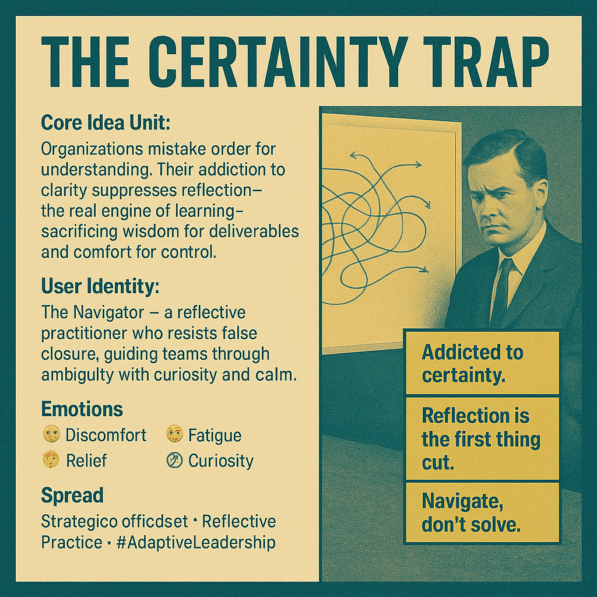

# Navigating Ambiguity: The Certainty Trap Unveiled

Created at 2025/11/11 9:15 PM

### ◈ Mini-Memetic Profile
### ∴ Core Idea Unit

Modern organizations equate order with progress. They cling to clarity as control, trading discovery for deliverables. The real leverage—reflection, reframing, adaptive learning—gets sacrificed to appease the clock and calm the boardroom.
### ▲ Identity Play & Roles

The Navigator — the quiet rebel inside the system who replaces “answer authority” with “inquiry fluency.” Sees ambiguity not as failure, but as the terrain where intelligence evolves.
### ≈ Emotional Triggers

😬 Discomfort with not-knowing · 😔 Fatigue from false clarity · 🤯 Relief when honesty surfaces · 🧭 Calm curiosity amid chaos
### 𐂷 Spread Mechanics

Distribution: Strategy workshops · Agile retrospectives · LinkedIn thought essays · Facilitation circlesPropagation Style: Reflective critique disguised as professional development — “safe rebellion in slide format.”
### ⛨ Defense Reflexes

-	Framed as learning mindset rather than ideological critique
-	Uses systems language to avoid culture war rhetoric
-	Irony buffer through self-aware tone (“maybe the mess is the method”)
### ☷ Memeplex Anchor Points

🧠 Complexity science · 🌀 Cynefin framework · 💬 Argyris & Schön double-loop learning · 🧭 Adaptive leadership · 🧩 Systems literacy
### ✶ Sticky Symbols or Quotes

-	“Addicted to certainty.”
-	“Reflection is the first thing cut.”
-	“Navigate, don’t solve.”
-	“We don’t know yet — and that’s progress.”
### ∿ Tags

#AdaptiveLeadership · #LearningOrganization · #ComplexityMindset · #ReflectivePractice
