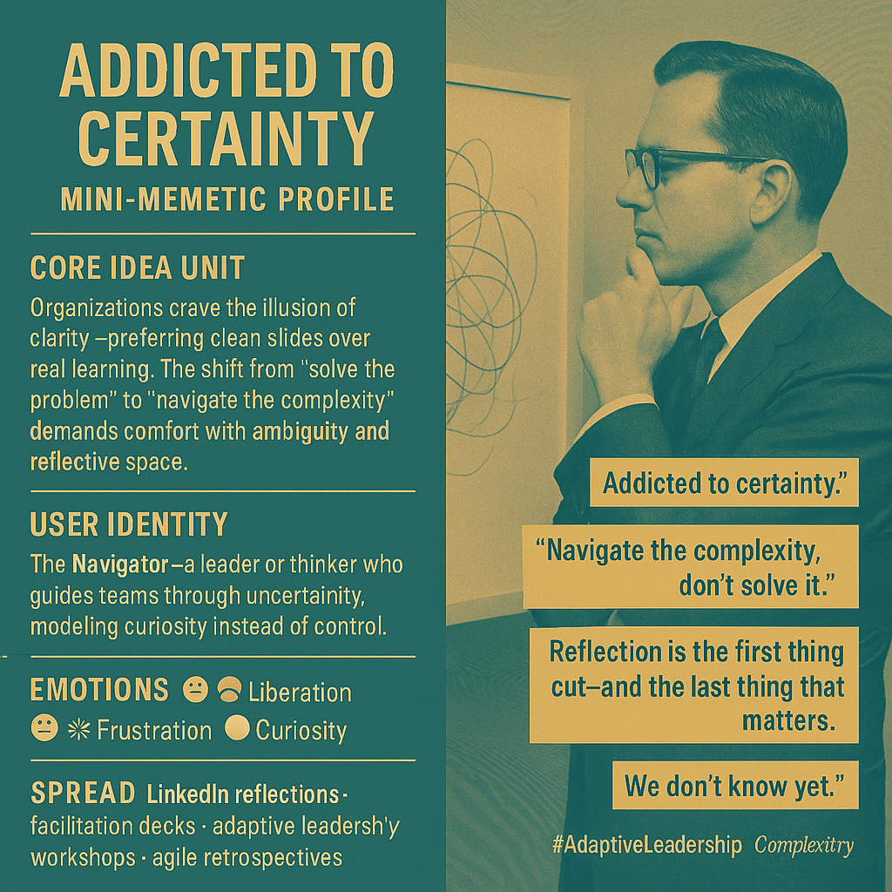

# Navigating Complexity: Embracing Uncertainty in Leadership

Created at 2025/11/11 8:47 PM

◈ Mini-Memetic Profile — “Addicted to Certainty”  ∴ Core Idea Unit: Organizations crave the illusion of clarity. They valorize decisiveness and polished decks, mistaking tidiness for truth. The real work—reflection, sense-making, adaptive learning—gets sacrificed at the altar of deliverables.  ▲ Identity Play & Roles: The Navigator — rejects the “heroic problem-solver” myth and embraces uncertainty as terrain. Acts as a field guide through ambiguity rather than a commander seeking closure.  ≈ Emotional Triggers: 😬 Anxiety at not knowing · 🧠 Curiosity re-emerging · 😔 Frustration at institutional inertia · 🤯 Liberation through reflective awareness  𐂷 Spread Mechanics: Distribution: LinkedIn think-threads · Miro boards · “Agile but wise” leadership circles Propagation Style: Reflective critique, soft rebellion against corporate optimization culture  ⛨ Defense Reflexes: Semantic humility — “We’re experimenting, not preaching.” Irony buffer — framed as “lessons learned” rather than insurgent philosophy. Counter-cooption — stays informal, conversational, embodied in practice not doctrine.  ☷ Memeplex Anchor Points: 📘 Organizational learning (Argyris & Schön) · 🌀 Complexity theory · 🧭 Adaptive leadership · 💬 Psychological safety · 🧩 Systems thinking  ✶ Sticky Symbols / Quotes: 	•	“Addicted to certainty.” 	•	“Navigate the complexity, don’t solve it.” 	•	“Reflection is the first thing cut—and the last thing that matters.” 	•	“We don’t know yet” as a leadership stance.  ∿ Tags: #AdaptiveLeadership · #ComplexityMindset · #CorporateTherapy · #MetaAgile · #LearningOrganization

## Resources
- https://object.me.bot/front-img/note/attachments/img/1762922857790/B90ECF3F-9300-4154-8B15-50972ACA8A93.png

## Insight

* Organizations often prioritize the appearance of clarity, favoring polished presentations over authentic learning experiences. This tendency can undermine deep reflection and critical analysis, emphasizing the need for a culture embracing ambiguity and iterative learning processes. 
* The archetype of "The Navigator" highlights a leadership style that thrives in uncertainty. This contrasts with traditional leadership roles that seek swift resolutions, emphasizing the importance of guiding teams through complex situations with a curious and adaptive mindset.
* Emotional responses such as anxiety and frustration are common in environments resistant to change, reinforcing the necessity for psychological safety and space for reflection. Cultivating such an environment can foster liberation and genuine engagement among team members.
* The propagation mechanisms, such as using LinkedIn for sharing insights, suggest a shift in discourse towards a more open, reflective approach in leadership circles. This aligns with modern views on agility and flat organizational structures, where collaboration is prioritized over rigid hierarchies.
* Key theoretical frameworks referenced, including organizational learning by Argyris and Schön, strengthen the call for embracing complexity in leadership. These frameworks advocate for continuous learning and adaptation, essential in today’s rapidly changing organizational landscapes.
