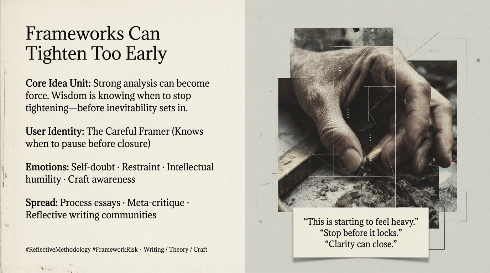

# Navigating Frameworks: The Art of Restraint

Created at 2026/01/20 12:57 PM

## 🧩 **Frameworks Can Tighten Too Early**

***

## 🧠 Core Narrative Structure

Insight begins to cohere.Analysis sharpens. A framework starts to *work*.

At this moment of strength, a risk appears:the framework begins to **reproduce the very harm it set out to diagnose**.

By naming too quickly, framing too tightly, or resolving too cleanly, the analysis:

- collapses possibility
- creates inevitability where contingency still exists
- turns inquiry into a **battlefield** rather than a listening space

Wisdom, in this moment, is not further articulation.It is **knowing when to stop tightening**—before motion becomes fate.

***

### ∴ Core Idea Unit

**Essential belief encoded:**Analytical power carries its own failure mode: premature closure disguised as clarity.

**Mental shift provoked:**From *“This framework explains what’s happening”* → *“Is this explanation already foreclosing what could still change?”*

The meme reframes restraint as **methodological competence**, not hesitation.

***

### ▲ Identity Play & Roles

**Writers / Theorists / Critics / Researchers**

- Work at the edge where sensemaking becomes commitment
- Feel the temptation to “lock it in” for elegance or force
- Face the ethical choice of when to stop framing

**Repositioning:**From *author of conclusions* → *steward of possibility*From *winning the argument* → *keeping inquiry alive*

The meme flatters **craftsmanship**, not certainty.

***

## ≈ Emotional Hooks & Cognitive Levers

- 🤔 **Self-doubt** — “Am I closing this too fast?”
- 🧘 **Restraint** — stopping short of inevitability
- 🧠 **Intellectual humility** — clarity without conquest
- 🛠️ **Craft ethics** — knowing when analysis becomes force

**Primary lever:**Transforms hesitation from weakness into a **signal of skill**.

***

### ⛨ Defense Reflexes

- **Meta-awareness** — framework applied to itself
- **Anti-triumphalism** — resists the urge to declare victory
- **Process emphasis** — focuses on how thinking proceeds
- **Battlefield refusal** — avoids adversarial framing

The meme deflects critique by preemptively questioning its own closure.

***

### ☷ Memeplex Anchor Points

- Reflective methodology
- Anti-reductionist critique
- Epistemic humility
- Craft ethics in thinking
- Process philosophy
- Meta-critique traditions

This meme travels well in spaces that value *how* thinking is done, not just *what* it produces.

***

### ✶ Sticky Symbols or Quotes

& Phrases

- **Heavy**
- **Tightening**
- **Inevitability**
- **Battlefield framing**
- “This is starting to feel sealed”
- “Stop before it locks”

These act as internal warning lights for thinkers.

***

### ∿ Tags

#ReflectiveMethodology · #FrameworkRisk · #EpistemicHumility · #CraftEthics · #MetaCritique · #AntiTriumphalism

***

### Quiet synthesis

**Frameworks Can Tighten Too Early** is not an argument against frameworks.It is a reminder that **every good tool becomes dangerous at the moment it stops listening**.

The highest form of analytical maturity may be this:

Knowing when a framework is *working*—and stopping just before it starts **deciding the future for you**.
