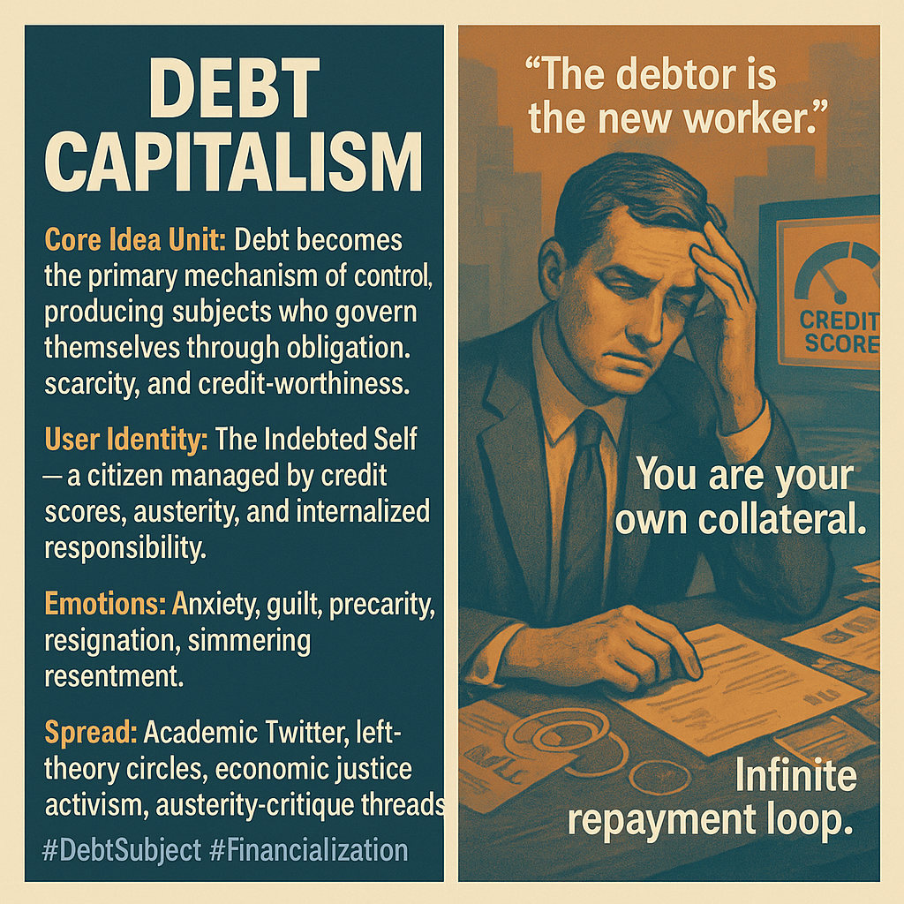

# The Indebted Self: Modern Labor Redefined

Created at 2025/11/19 9:10 AM

## **🧩 Title: Debt Capitalism**

## **🧠 Core Idea Unit**

Debt replaces labor as the central mechanism of control. The subject is remade as a perpetual debtor—disciplined not by bosses, but by credit, austerity, and obligation. The shift: from exploitation → *indebted self-management*.

## **🎭 Identity Play & Roles**

**The Indebted Self**, the Optimized Striver, the Shame-Conditioned Citizen, the Credit-Scored Subject. Position: not worker vs. owner, but debtor under creditor sovereignty.

## **💥 Emotional Triggers**

Low-grade anxiety, looming guilt, precarity, quiet resentment, humiliating self-blame, exhaustion, resignation, and a desire for escape or exodus.

## **📡 Spread Mechanics**

**Distribution:** academic Twitter, left-theory circles, economic justice feeds, student-debt activism, austerity critique spaces. **Style:** sober indictment, analytic fatalism, structural exposure, moral unveiling.

## **🛡️ Defense Reflexes**

Irony-shielding via economistic jargon; moral reframing (“you borrowed it, pay it”); pathologizing critique (“financial illiteracy”); obscuring systemic design behind personal responsibility.

## **🧬 Memeplex Anchor Points**

Autonomist Marxism · Neoliberal governmentality · Foucault + Lazzarato · Graeberian anthropology · Post-2008 austerity · Racialized finance regimes · Education commodification.

## **🧠 Sticky Symbols / Quotes**

• “The debtor is the new worker.” • Credit-score halos • Infinite repayment loops • Austerity as moral theater • “You are your own collateral.” • Chains made of contracts, not iron.

## **🏷️ Tags**

#DebtSubject · #AusterityLogic · #NeoliberalGovernmentality · #Financialization

[Research via Grok on Debt Capitalism concept](https://app.me.bot/public/RAPWUVOIYBJKQPBO)

## Resources
- https://object.me.bot/front-img/users/send/img/1763571856570_c4zhf/11a1c643-a009-4920-a5af-a034b162f8e6.png

## Insight

* The image encapsulates the concept of "Debt Capitalism," emphasizing how debt has supplanted labor as the primary mechanism of societal control. This aligns with the notion that individuals are increasingly defined by their financial obligations rather than their roles in traditional labor structures. The shift from exploitation to indebted self-management highlights a profound transformation in how power dynamics operate within capitalism.

* The portrayal of subjects as "The Indebted Self" illustrates how individuals have become intricately linked to credit scores, presenting their financial health as a reflection of their moral worth. This dependency on credit creates an insidious form of governance, where one's identity and agency are contingent upon fulfillment of financial obligations, leading to feelings of anxiety and guilt associated with indebtedness.

* Emotional triggers such as low-grade anxiety and resignation reflect a pervasive climate of precarity. The burden of chronic financial obligation induces a sense of helplessness and a desire for escape, revealing the personal toll that systemic financialization takes on individuals. Such emotional states can engender simmering resentment towards institutions that perpetuate these conditions.

* The concept of the debtor as the new worker challenges conventional frameworks of labor relations. In this lens, individuals become “collateral” in a financial system that prioritizes profit over human dignity, shifting the focus from traditional class struggle to a nuanced understanding of credit and obligation. This reframing invites discussion on the ethical implications of a society that commodifies debt.

* The dissemination of these ideas through platforms like academic Twitter and economic justice activism highlights a growing awareness of the systemic failings of neoliberal capitalist policies. By critiquing the narrative of personal responsibility and exposing the structures that enable financial exploitation, movements can advocate for systemic change that addresses the root causes of economic injustice.

* Symbols and quotes in the image, such as “You are your own collateral,” resonate with contemporary discussions around financialization and its effects on societal wellbeing. This rhetoric serves to highlight the paradox of neoliberal ideologies that elevate individual responsibility while ignoring the structural inequities that underpin economic relationships. 

* Overall, the image serves as a visual manifesto against the backdrop of austerity and financialization, urging viewers to reconsider the implications of their identities as indebted individuals within a market-driven society, and inviting critical discourse around the ethics of debt in contemporary culture.
