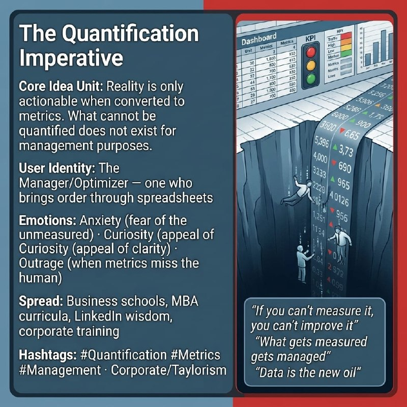

# The Quantification Imperative

Created at 2026/03/30 10:04 PM

### ◈ Mini-Memetic Profile

**🔶 The Quantification Imperative — You Can't Manage What You Don't Measure**

### ∴ Core Idea Unit

- Reality is only actionable when converted to metrics. What cannot be quantified does not exist for management purposes.
- Encodes a worldview where legibility = controllability, and ambiguity is a threat to be eliminated through data collection.
- Transforms complex systems into dashboard-friendly abstractions, privileging what can be counted over what counts.

### ▲ Identity Play & Roles

- **The Manager/Optimizer:** One who brings order through spreadsheets, believes numbers reveal truth.
- **The Rational Actor:** Transcends subjective "gut feel" through objective data.
- **The Diagnosed Subject:** Employees, processes, and creativity become measurable units subject to optimization.

### ≈ Emotional Triggers

- **Anxiety** — fear of the unmeasured, the unknown, flying blind
- **Curiosity** — desire to understand through numbers, the appeal of clarity
- **Outrage** — when metrics clearly miss qualitative, human dimensions
- **Awe** — at the scale of modern analytics, predictive algorithms, "big data"

### 𐂷 Spread Mechanics

- **Distribution Vectors:**
    - Business schools, MBA curricula, management consulting, startup culture
    - Self-help productivity spaces, LinkedIn thought leadership, corporate training materials
- 
- **Propagation Style:**
    - Aphoristic wisdom format
    - Authority citation (attributed to Deming, Drucker, Peters)
    - "Common sense" framing, infographic-friendly presentation
    - "What gets measured gets managed" — mantra-like repetition

### ⛨ Defense Reflexes

- **Appeal to authority:** "Deming said it, and he revolutionized manufacturing"
- **Semantic slipperiness:** "Measure" stretches from hard metrics to "gut feel" depending on critique
- **Counter-narrative preemption:** "I know metrics aren't everything BUT..."
- **Survival bias:** Only successful metrics-driven companies survive to tell the tale

### ☷ Memeplex Anchor Points

- Scientific management / Taylorism / Fordism
- Data-driven decision making / "evidence-based" management
- Surveillance capitalism (Zuboff)
- Corporate bureaucracy and performance review culture
- Growth metrics obsession (KPIs, OKRs, vanity metrics)
- Algorithmic management and workplace monitoring

### ✶ Sticky Symbols or Quotes

- "If you can't measure it, you can't improve it"
- "What gets measured gets managed"
- "Data is the new oil"
- Dashboard iconography, spreadsheet aesthetics, traffic light indicators (red/yellow/green)
- The Balanced Scorecard, OKR frameworks

### ∿ Tags

#Quantification #Metrics #Management #DataDriven #Taylorism #SurveillanceCapitalism #Legibility #Productivity #Corporate #Optimization
