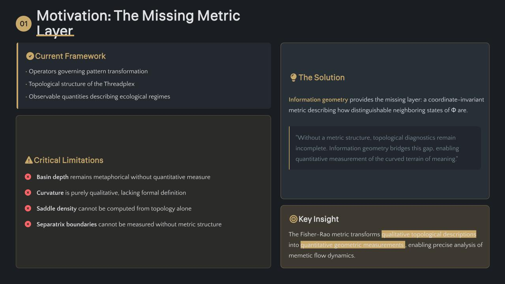

# Information-Geometric Integration: Fisher–Rao Structure of the Φ Manifold

.png)

.png)
.png)
.png)
.png)
.png)
.png)
.png)
.png)
.png)

*(Draft v3.3-IG)*

Acknowledgment: The author thanks **Fport** for drawing attention to the relevance of Fisher–Rao geometry and statistical-manifold thinking for describing the curved terrain of meaning, reasoning, and memetic flow.

---

# Abstract

Memetic Ecology formalizes cultural dynamics through the field equation

$$
\Phi(t) = (Z \circ \Psi \circ Q \circ \chi)(\Omega) \oplus_{\text{harmonic}} \Omega
$$

Previous documents established the **operator architecture** (v3.2), **Thread–Knot–Threadplex topology**, and **observable derivation** (v3.3). What remained missing is a **metric structure** allowing the geometry of this system to be measured rather than described.

This paper integrates **information geometry**, specifically the **Fisher–Rao metric**, into the Memetic Ecology framework. The result is a Riemannian structure on the configuration manifold of Φ, enabling the formal measurement of basin curvature, saddle structure, separatrix gradients, and twist in the Threadplex.

The bow-tie compression architecture of the framework naturally corresponds to a **statistical submanifold** within a larger inference manifold. Information geometry therefore provides both the mathematical metric and a theoretical explanation for why bow-tie compression appears as a universal structure in adaptive systems.

---

# 1. Motivation

Memetic Ecology already defines:

- operators governing pattern transformation
- topological structure of the Threadplex
- observable quantities describing ecological regimes

However, these remain **topological diagnostics**.

Without a metric structure:

- basin depth is metaphorical
- curvature is qualitative
- saddle density cannot be computed
- separatrix boundaries cannot be measured

Information geometry provides the missing layer: a **coordinate-invariant metric** describing how distinguishable neighboring states of Φ are.

---

# 2. Statistical Manifolds and the Φ Configuration Space

Information geometry treats a family of probability distributions as a smooth manifold.

Each point on the manifold corresponds to a probability distribution $p(x;\theta)$.

The parameter space becomes a **statistical manifold**

$$
\mathcal{M} = \{ p(x;\theta) \mid \theta \in \Theta \subset \mathbb{R}^d \}
$$

The tangent space at each point is spanned by **score functions**

$$
s_i(x;\theta) = \frac{\partial \log p(x;\theta)}{\partial \theta_i}
$$

These reside in the Hilbert space $L^2(p)$ under the expectation inner product.

---

### Mapping to Memetic Ecology

| Statistical manifold | → | configuration manifold of Φ |
|----------------------|---|-----------------------------|
| Probability distribution | → | memetic configuration |
| Parameter shift | → | change in ecological configuration |
| Score functions | → | infinitesimal σ-operations (distinctions) |

Thus the Memetic Ecology field can be treated as evolving across a **curved manifold of distinguishable cultural states**.

---

# 3. Fisher–Rao Metric

The Fisher information matrix defines the intrinsic metric on the manifold.

$$
g_{ij}(\theta) = \mathbb{E}_{p(x;\theta)} \left[ \frac{\partial\log p}{\partial\theta_i} \frac{\partial\log p}{\partial\theta_j} \right]
$$

giving the squared distance

$$
ds^2 = g_{ij}(\theta)d\theta^i d\theta^j
$$

This metric measures how distinguishable two nearby probability distributions are from data.

Two properties make the Fisher metric essential:

**Reparameterization invariance**
Distances do not depend on coordinate choice.

**Uniqueness under sufficient statistics**
Čencov's theorem shows that, up to scaling, it is the only Riemannian metric with this invariance property.

For Memetic Ecology this ensures that geometry reflects **actual informational distinguishability**, not arbitrary representational coordinates.

---

# 4. Geodesics as Thread Trajectories

On a Riemannian manifold, shortest paths are **geodesics**.

These satisfy

$$
\frac{d^2\theta^i}{dt^2} + \Gamma^i_{jk} \frac{d\theta^j}{dt}\frac{d\theta^k}{dt} = 0
$$

where $\Gamma^i_{jk}$ are Levi-Civita connection coefficients.

Within the Memetic Ecology model:

| Concept | Geometric interpretation |
|---------|-------------------------|
| Thread | → geodesic trajectory |
| Knot | → local minimum of potential landscape |
| Threadplex | → network of interacting geodesic basins |

Thus memetic flow can be understood as trajectories through curved statistical space.

---

# 5. Bow-Tie Compression as Statistical Submanifold

The Memetic Ecology architecture places strong emphasis on the **bow-tie bottleneck**.

Information geometry gives this structure a precise interpretation.

A bow-tie architecture compresses high-dimensional input distributions into a lower-dimensional latent manifold:

$$
\mathcal{N} \hookrightarrow \mathcal{M}
$$

Here:

- $\mathcal{M}$ is the full statistical manifold
- $\mathcal{N}$ is the compressed submanifold

The Fisher metric restricted to $\mathcal{N}$ measures how much information survives the compression.

If curvature near the data distribution is concentrated along certain directions, a low-dimensional submanifold can preserve most of the relevant structure while discarding flat noise directions.

Thus the bow-tie bottleneck is not merely dimensional reduction but **Riemannian compression of Fisher information volume**.

---

# 6. Observables in Metric Form

Once the Fisher metric is defined, previously derived observables become measurable.

Examples:

### Basin Depth
Local potential curvature measured through the Hessian of the metric potential.

### Saddle Density
Number of negative-curvature regions in the manifold.

### Separatrix Sharpness
Magnitude of gradient separating adjacent attraction basins.

### Twist
Torsion in the operator bundle connection.

These quantities correspond to ecological features already described qualitatively in Threadplex topology.

---

# 7. Natural Gradient and Directional Flow

Ordinary gradient descent moves in Euclidean parameter space.

Natural gradient corrects this using the Fisher metric:

$$
\tilde{\nabla}L = g^{-1}(\theta) \nabla L
$$

This produces trajectories that follow the steepest descent relative to the manifold's geometry.

In Memetic Ecology terms:

**λ (direction)** is modulated by **ρ (relational curvature)** so that trajectories respect the local geometry of meaning.

---

# 8. Curvature and Ecological Regimes

Curvature becomes the key diagnostic.

- **High curvature regions** → brittle inference zones → potential memetic capture
- **Low curvature valleys** → stable interpretive regimes
- **Mixed curvature regions** → generative exploration zones

---

### Co-SPHERE

A Co-SPHERE ecology exhibits:

- distributed curvature
- multiple basins
- high saddle density
- permeable separatrices

This geometry allows diverse geodesic trajectories.

---

### MemeGrid

A MemeGrid regime shows:

- curvature collapse around dominant attractor
- saddle elimination
- hardened separatrices

Geodesic diversity disappears.

The manifold effectively degenerates into a single attractor basin.

---

# 9. Role of ε

The Memetic Ecology invariant $\varepsilon \neq 0$ becomes geometrically meaningful.

If ε vanished completely, nearby distributions would become indistinguishable.

The Fisher metric would collapse.

Thus ε maintains **local distinguishability on the manifold** and prevents geometric degeneracy.

---

# 10. Implications

The Fisher–Rao integration provides three capabilities previously absent from the framework.

### Measurement
Topological diagnostics become computable quantities.

### Interpretation
Curvature explains why certain compressions or reasoning paths succeed.

### Navigation
Natural-gradient flows describe optimal movement through the Threadplex.

---

# 11. Relation to Boundary Dynamics

This paper defines the **metric layer** of the architecture.

Boundary Dynamics will address the **mechanisms by which regimes change**, including:

- MemeGrid formation
- Co-SPHERE maintenance
- boundary propagation across habitats

The Fisher geometry describes how closure appears in the manifold but does not itself explain the causal mechanisms that generate it.

---

# Conclusion

Information geometry reveals that the Memetic Ecology architecture already corresponds to a **curved manifold of cultural configurations**.

The Fisher–Rao metric supplies the intrinsic geometry needed to measure this terrain.

Threads become geodesics, knots become attractor basins, and the Threadplex becomes a curved statistical manifold shaped by informational distinguishability.

The bow-tie compression central to the framework emerges as a natural statistical submanifold preserving relevant Fisher information while discarding noise.

With this integration, the architecture now possesses:

- operators
- topology
- observables
- metric geometry

The remaining step is the study of **boundary dynamics**, where regime transitions reshape the manifold itself.
