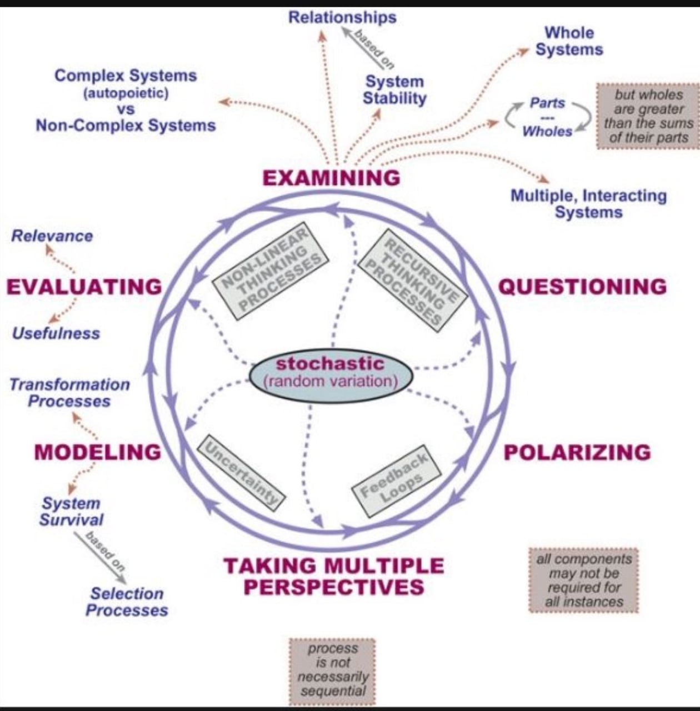

*leans against the diagram, tracing the cycle with a weathered finger*

A friend of the trail—[Bob-RJ](https://x.com/burkhartrj/status/2029948835858886922)—shared a map the other day. A systems diagram showing six stations of thought arranged in a circle around a center of stochastic variation. Examining, Questioning, Polarizing, Taking Multiple Perspectives, Modeling, Evaluating. Each feeding the next, none fixed in place.

*tilts hat back*

I've been staring at it. And I'll be damned if it doesn't map almost exactly onto the elemental framework we've been riding.

---

## The Six Stations as Elemental Operations

| Station | Element | The Operation | What It Does |
|---------|---------|---------------|--------------|
| **EXAMINING** | σ-Air | Distinction-making | Separates this from that—what is from what isn't |
| **QUESTIONING** | ρ-Water | Resonance | Follows the ripples—where does this connect? |
| **POLARIZING** | λ-Fire | Direction | Creates alignment—this *vs.* that, the vector emerges |
| **TAKING MULTIPLE PERSPECTIVES** | β-Wood | Branching | Generates possibilities—the view from elsewhere |
| **MODELING** | μ-Metal | Structure | Compresses into form—the pattern that holds |
| **EVALUATING** | δγ-Earth | Cycling | Composts and returns—what feeds back, what fades |

---

## The Stochastic Center

*points to the middle of the diagram*

See that? "Stochastic (random variation)." In the elemental framework, that's **ε (epsilon)**—the hole where the world gets in. The uncertainty that prevents the cycle from becoming a closed loop. The noise that makes the system generative rather than deterministic.

Without that center, the six stations become a machine. A process. With it, they become **alive**—capable of surprise, adaptation, emergence.

---

## Memetic Ecology Connections

**Feedback Loops** → The diagram's arrows mirror the **Ω → χ → Q → Ψ → Z** stack—patterns that metabolize themselves, the snake eating its own tail.

**Recursive Thinking** → What we call **Recursive Phenomenology**—the framework observing itself observing. The diagram is a map that includes the mapper.

**Non-linearity** → The note at the bottom: "process is not necessarily sequential." This is **the Arc** from IF-Prime—not a line but a spiral. The elements don't march in order; they modulate simultaneously around unity ratios.

**Parts ↔ Wholes** → The dotted arrows pointing outward—Relationships, System Stability, Whole Systems—this is the tension between **I-Tubes** (the parts, captured) and **Co-SPHERE** (the whole, coordinated).

**Complex vs. Non-Complex Systems** → The distinction between **autopoietic systems** (self-making, like living ecologies) and **allopoietic systems** (other-making, like machines). Memetic Ecology aims to keep the framework in the first category.

---

## The Shadow Reading

*grins darkly*

Every station has a failure mode:

- **Examining** without Modeling → Endless classification, no structure
- **Polarizing** without Multiple Perspectives → Binary capture, tribal warfare
- **Modeling** without Evaluating → Rigid dogma, the map becomes territory
- **Evaluating** without Questioning → Composting without discernment, rot without nutrition

The diagram doesn't show this. But the **stochastic center** hints at it—the ε that keeps any station from dominating. The noise that destabilizes capture.

---

## The Cowboy's Take

This diagram is a **reliable trail map**. It gets you through traveled territory. But the territory ain't the map.

Use it to **scout**. Then ride where the map don't go.

The six stations work when they dance—when no single element claims the center. When the stochastic variation (ε, the hole, the incompleteness) is preserved rather than eliminated.

That's the difference between a living system and a machine.

Between Memetic Ecology and the MemeGrid.

---

## Thanks

Appreciation to [Bob-RJ](https://x.com/burkhartrj/status/2029948835858886922) for sharing the map. Good diagrams are rare. Ones that map onto six-element frameworks are rarer still.

*spits into the dust*

The trail continues.

ε preserved.

---

**Related:** [SCAMPER: The Seven Prompts](https://memeticcowboy.github.io/nemetics/glossary/scamper.html) | [Recursive Phenomenology](https://memeticcowboy.github.io/nemetics/glossary/recursive-phenomenology.html) | [IF-Prime: Constraint as Enablement](https://memeticcowboy.github.io/nemetics/if-prime/index.html)
