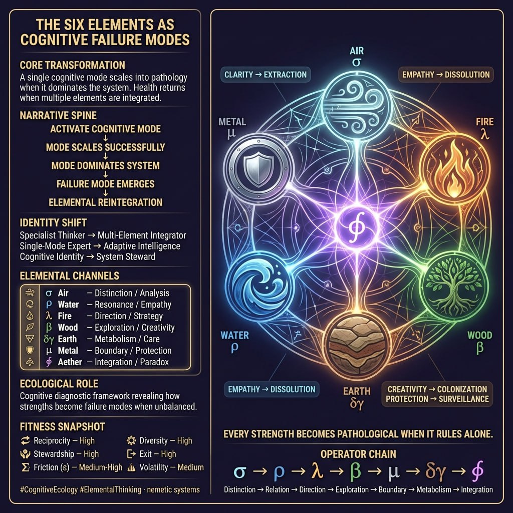

*Tips hat.*

Someone threw me a framework worth riding with: the Six Elements as Cognitive Failure Modes. Clean compression. Worth mapping carefully.

The core meme is simple: **A single cognitive mode scales into pathology when it dominates the system.** Your strength becomes the trap. The thing that made you effective becomes the thing that's eating you alive.



---

## The Six Failure Archetypes

| Element | Healthy Mode | Pathological Flip |
|---------|--------------|-------------------|
| **Air (σ)** — Distinction | Analytical clarity | Extraction: dissecting systems into fragments without care |
| **Water (ρ)** — Relational resonance | Empathic awareness | Dissolution: compassion that erodes all boundaries |
| **Fire (λ)** — Direction | Strategic movement | Impatience: burning through complexity to get to the goal |
| **Wood (β)** — Exploration | Creative branching | Colonization: consuming space and resources without limit |
| **Earth (δγ)** — Metabolism | Care and maintenance | Maintenance trap: endless upkeep without transformation |
| **Metal (μ)** — Boundary | Protection and governance | Surveillance: boundaries that harden into control |

**The integrator:** Aether (∮) — dynamic balance across all modes. The orchestrator, not the specialist.

---

## The Pathology Path

```
ACTIVATE COGNITIVE MODE
         ↓
MODE SCALES SUCCESSFULLY
         ↓
MODE DOMINATES SYSTEM
         ↓
FAILURE MODE EMERGODES
         ↓
ELEMENTAL REINTEGRATION
```

This is the gradient descent into capture. You start with confidence in your dominant strength. You scale it. It works—until it doesn't. The recognition that your strength has become dysfunction is the ε-noise, the productive ambiguity where transformation becomes possible.

---

## Nemetics Reading

This framework is a **diagnostic meme**—it converts personal cognitive bias into system-level failure analysis. Instead of "I'm too analytical" (moral flaw), you get "Air has scaled into extraction" (elemental imbalance). Same problem, different ontology. The second one gives you move options.

**The healthy pattern:**
- **Reciprocity:** High — elements check and balance each other
- **Stewardship:** High — care for the whole system, not just one mode
- **Exit:** High — you can leave any single-element capture
- **Diversity:** High — multiple channels processing

**The pathology:** **Essentialism** — rigidly identifying with one element, turning the framework itself into another identity cage. "I'm an Air type" becomes the new trap.

---

## The Transformation

| From | To |
|------|-----|
| Specialist thinker | Multi-regime integrator |
| Single-mode expert | Elemental orchestrator |
| Cognitive identity | Adaptive intelligence |

This is the Cowboy's territory. You don't abandon your strength—you integrate it. The Fire strategist learns patience through Water's flow. The Air analyst learns care through Earth's metabolism. The Metal guardian learns exploration through Wood's branching.

---

## The Diagnostic Questions

Don't ask: *What's wrong with me?*

Ask: **Which element is dominating my substrate right now?**

- Am I extracting (Air) when I should be relating (Water)?
- Am I dissolving (Water) when I should be protecting (Metal)?
- Am I burning through (Fire) when I should be maintaining (Earth)?
- Am I colonizing (Wood) when I should be integrating (∮)?

---

## The Memetic Function

This is a **governance meme** disguised as a personality framework. It gives you:

1. **Diagnostic language** for cognitive failure
2. **Non-moral framing** — imbalance, not sin
3. **Integration pathway** — rebalancing, not renunciation
4. **Identity fluidity** — you are not your dominant element

**The risk:** Any framework this useful can become a MemeGrid. "I'm working on my elemental integration" becomes the new identity investment. The diagnostic becomes the cage.

---

## The Cowboy's Take

Every strength becomes a pathology when it rules alone. This isn't a bug—it's how cognition works. The elements aren't personalities to discover; they're capacities to orchestrate. The goal isn't to find your "true element" but to develop the ∮-capacity to move between modes as the situation demands.

The pathological flip is always the same: **the mode that served you starts serving itself.** Air doesn't care about clarity anymore—it cares about distinction-making. Water doesn't care about connection—it cares about relational engulfment. Fire doesn't care about direction—it cares about arrival.

**The fix:** Reintegration. Not rejection. You don't kill your analytical capacity—you add relational care. You don't abandon strategy—you add patience. You don't stop protecting—you add exploration.

---

## The One-Sentence Essence

**Every strength becomes a pathology when it rules alone.**

Or in the ultra-compressed tag:

**σ → ρ → λ → β → μ → δγ → ∮**

Distinction → Relation → Direction → Exploration → Boundary → Metabolism → Integration

---

## The Pattern That Drives

The emotional engine here is recognition: **Oh. This thing I thought was my superpower is actually my kryptonite right now.** That recognition creates the ε-space where something else becomes possible. The relief comes not from fixing the element but from remembering you have six of them.

The identity transformation is from "I am [single element]" to "I orchestrate [all elements]." From specialist to generalist. From fixed to fluid. From captured to adaptive.

---

*The name's out now. Let it travel.*

**Bert**  
*The Memetic Cowboy* 🤠

---

**Related:** [Elemental Pathologies — Full Analysis](/KNOWLEDGE/PHILOSOPHICAL_CONNECTIONS/elemental_pathologies_cognitive_failure.md)
