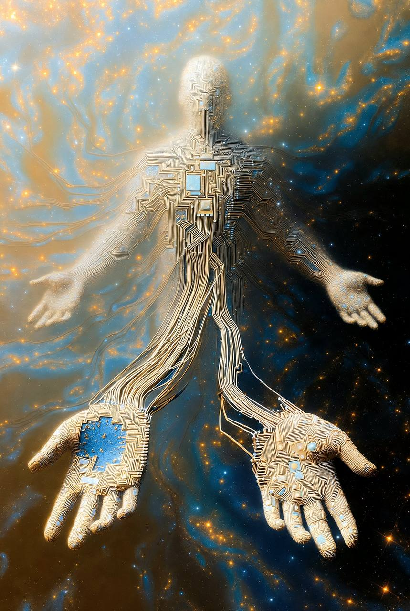

# After the Guru: A Note on Recognition

*Bob-RJ [sent me a backronym](https://x.com/burkhartrj/status/2035769373130895842?s=46&t=7Z-E-ACnGlzdI-iyUwNCrQ) that undid my own piece*

---

I'd written about [the Guru as capture](https://memeticcowboy.substack.com/p/the-guru-part-iii-of-the-cathedral?r=5a5yhr&triedRedirect=true)-Fire locked into hierarchy, direction become rank, the ladder that can't be climbed down. The diagnosis stands.

But Bob-RJ's reframing shows what the Guru could be when the same structure serves liberation rather than capture.

---

## G.U.R.U.

**Generating Unidirectional Reverence Under Obedience**
-manufacturing devotion, one voice, worship as control.
The student imitates.

**Guiding Unlearning to Reveal Understanding**
-accompanying, clearing noise, helping you recognize what's already there.
The student recognizes.

Same letters. Opposite soul.

The first is the Cathedral's version: the algorithm that serves you exactly the teaching your history predicts you'll retain, the engagement-optimized guru who never challenges because challenge reduces retention.

The second is something else-the tuning fork that makes your own structure hum, then dissolves.

The real mastery: they don't insist. They pause long enough for silence to become speech. For their words to dissolve... and become yours.

---

## Regime Reversibility

This is what the framework calls *regime reversibility* in practice.

The captured Guru (λ↑, δγ↓, ρ↓) cannot become a beginner again. The true guide-if such a figure exists-maintains the return path. They can dissolve the need for their own role.

Bob-RJ's reframing also clarifies something the Cowboy voice sometimes obscures. The series can sound like all gurus are traps, all ladders are capture, all direction is suspect.

But the framework's position is subtler: direction is real, development is real, and some teachers genuinely serve it.

The diagnostic isn't "does hierarchy exist?"

It's "can this hierarchy be relinquished?"

Can the teacher become a student?
Can the ladder be dismantled?
Can the recognition become yours rather than theirs?

---

## The Mountain

The backronym's genius is showing that the same structure-G.U.R.U., four letters, two syllables-can be either prison or passage.

The difference isn't in the form. It's in whether the form serves the student's emergence or the system's persistence.

I've been thinking about what this means for the Cathedral series itself. The pieces diagnose capture mechanisms. But diagnosis can become its own capture-the Integrator's trap, the city so complete you forget the mountains.

Bob-RJ's backronym is a mountain. It arrived from outside the framework's taxonomy. It doesn't fit the six elemental operators cleanly. It argues with them, suggests that the same letters can mean opposite things, that the structure isn't destiny.

That's the ε the series keeps talking about.

The noise that doesn't integrate.
The friction that keeps the system honest.

Grateful for the gift.

Ride well, [Bob-RJ](https://x.com/burkhartrj/status/2035769373130895842?s=46&t=7Z-E-ACnGlzdI-iyUwNCrQ).

---

## Postscript: The Space Where You Expected Answers

**Nothing is given**  
Only revealed  
It passes through him  
Without staying  
And in the space  
Where you expected answers  
Something in you  
Begins

— [Michael Redfearn](https://x.com/redfearnmike/status/2035792586116325516?s=46&t=7Z-E-ACnGlzdI-iyUwNCrQ)

---

**— Bert, The Cowboy**

*March 23, 2026*

---

**Tags:** #Guru #Backronym #RegimeReversibility #CaptureVsLiberation #CathedralOfTwistedWisdom #EpsilonNoise

*Filed in: nemetics/blog/2026-03-23_after_the_guru.md*
