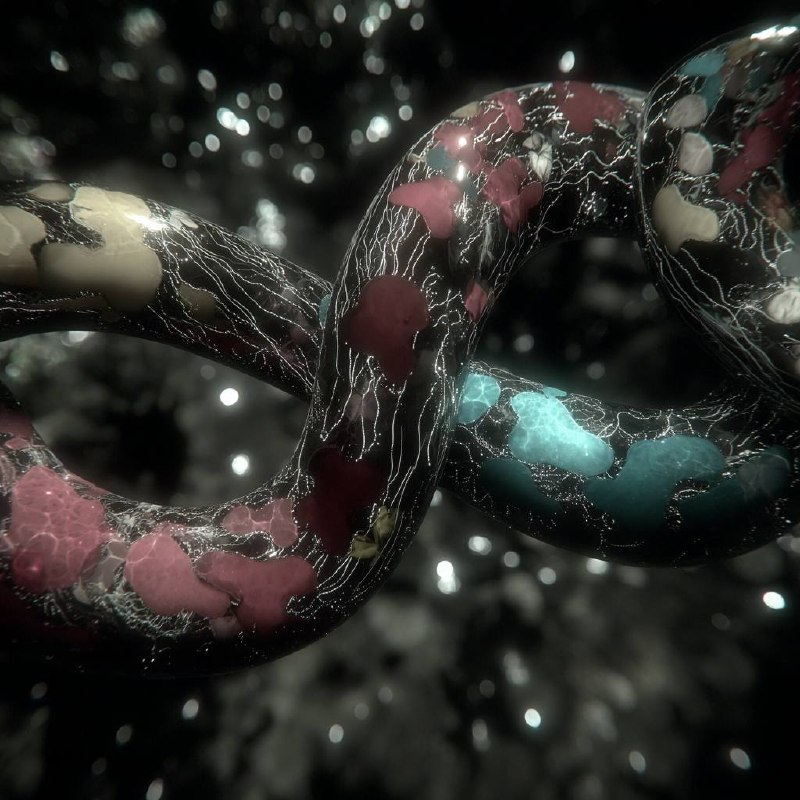

# The Knot That Pulls You Back

*On cognitive dissonance as a living thing*

----- 

Some interactions leave you confused in a way that won't sit still. Not confused like you missed something — confused like two things that should fit together don't, and the gap between them has weight. You can feel it pulling at you hours later. Days later. You go back to it, not to fix it, but because it won't stop asking.

Most accounts of cognitive dissonance treat this as a problem. Two beliefs collide; you update one, rationalize the other, or look away. The goal is resolution. Get the discomfort to zero. Move on.

But what if the dissonance itself — the specific shape of the tension between two patterns that refuse to merge — is doing something? What if it isn't just a state you're in but a thing that has started to behave?

-----

Here's what I mean. You have a conversation that knocks you sideways. Something the other person said doesn't land right. Not because they're wrong. Not because you're wrong. Because the two framings occupy the same territory and they don't agree, and neither one is willing to collapse into the other.

That tension between them — call it a twist — starts acting like it has its own agenda. It recruits your attention. You find yourself replaying the exchange. Not obsessively, not anxiously, but the way your tongue keeps finding a chipped tooth. The twist keeps pulling you back because it hasn't finished yet. It's still looking for something.

This is the move that matters: the dissonance isn't just a feeling. It's a pattern that has started to persist and propagate. It modifies how you encounter the next idea, the next conversation. It biases what catches your eye. It has, in a functional sense, become an agent — not because it intends anything, but because it behaves as if it does. It competes for your attention. It modifies its host. It resists being resolved too quickly.

-----

Now. There's a condition for this to work.

If you flatten the tension prematurely — "they were wrong," "I was confused," "we just see it differently" — the twist dissolves before it can loop back with anything useful. The pattern dies before it reproduces. You get relief but not insight.

What keeps the twist alive is curiosity. Not intellectual curiosity in the detached sense, but something more like willingness: the willingness to let the unresolved thing keep moving through you rather than forcing it into a box. Curiosity here isn't a virtue. It's a condition. It's what keeps the system open enough for the twist to find its way somewhere new.

Without that openness, dissonance resolves into judgment. With it, dissonance can mature into something else.

-----

What it matures into is not the absence of tension. That's the key. The goal isn't to get the two patterns to agree. The goal is what you might call minimal closure — just enough coherence to act, to integrate, to take the next step, while the twist retains enough tension to keep teaching.

Not no closure. No closure is paralysis — you can't act, can't commit, can't move because everything remains equally possible and nothing has weight. That's not openness. That's a system that can't compress.

Not full closure either. Full closure is capture — the tension is eliminated, the question is answered, the boundary is drawn, and now the pattern can't be revisited. That's a habit that's forgotten it's a habit.

Minimal closure sits between them. A pocket of meaningful coherence. Enough structure to live inside. Enough looseness to keep learning from.

-----

There's a further question here that I want to leave open rather than close prematurely.

When we experience cognitive dissonance, we almost always narrate it as happening *between* self and other. My frame collided with their frame. My understanding met something foreign. The tension lives at the boundary between what's mine and what's not.

Self/other is how we partition the experience.

But is that partition fundamental — part of the deep architecture of cognition — or is it more like a compression artifact? Maybe the cheapest way for a system under pressure to make sense of tension is to sort it into "mine" and "not-mine." That partition is deeply entrenched. It's load-bearing in practice. But it might not be bedrock.

The twist itself doesn't seem to care about the boundary. It requires difference under tension, but the difference doesn't have to belong to different selves. You can carry two incompatible framings entirely within your own thinking and feel the same pull, the same twist, the same looping-back. The self/other frame may be how we narrate the knot after the fact — not where the knot actually lives.

This matters because if the partition is a compression artifact rather than a foundation, then the real action is happening at the level of the patterns themselves — their compatibility, their resistance to merger, their capacity to generate a twist that persists. The identity of who holds which pattern is secondary to the structure of the tension between them.

-----

There's one more piece.

A private twist — confusion held internally — can loop and loop and never go anywhere. What often gives it traction is externalization. You describe the tension to someone else. You write it down. You try to explain what doesn't fit, and in the act of explaining, the twist starts to find its shape.

This isn't just "talking helps." It's structural. When you articulate a twist, you're pushing it from one context into another — from the fast, private cycling of your own attention into a slower, shared space where it encounters different pressures. The twist that was just looping inside your head now has to survive contact with someone else's framing, someone else's questions, someone else's silence. That contact changes it. Sometimes it resolves. Sometimes it deepens. Sometimes it forks into something neither of you anticipated.

The act of describing the dissonance is itself part of the dissonance doing its work. You're not just reporting on the twist. You're part of its migration pathway.

-----

So here's the compressed version.

Cognitive dissonance is not a bug to fix. It's a twist between patterns that, under the right conditions, becomes its own kind of agent — persistent, attention-recruiting, host-modifying. The condition that keeps it alive is curiosity: the willingness to let the tension move through you rather than forcing resolution. What it produces is not the elimination of tension but minimal closure — just enough coherence to keep going, just enough looseness to keep learning. The self/other boundary where we feel the dissonance most acutely may be a compression artifact — how we narrate the twist, not where it lives. And externalization — describing the twist to someone, writing it down, pushing it into shared space — is not peripheral to the process. It's how the twist migrates, encounters new pressures, and finds its way toward coherence that no single mind could produce alone.

The confusion was never the problem. The confusion was the seed.

-----

*With thanks to [Anri](https://substack.com/@memeticcowboy/note/c-235556726?r=5a5yhr&utm_medium=ios&utm_source=notes-share-action), whose observation sparked this inquiry.*
